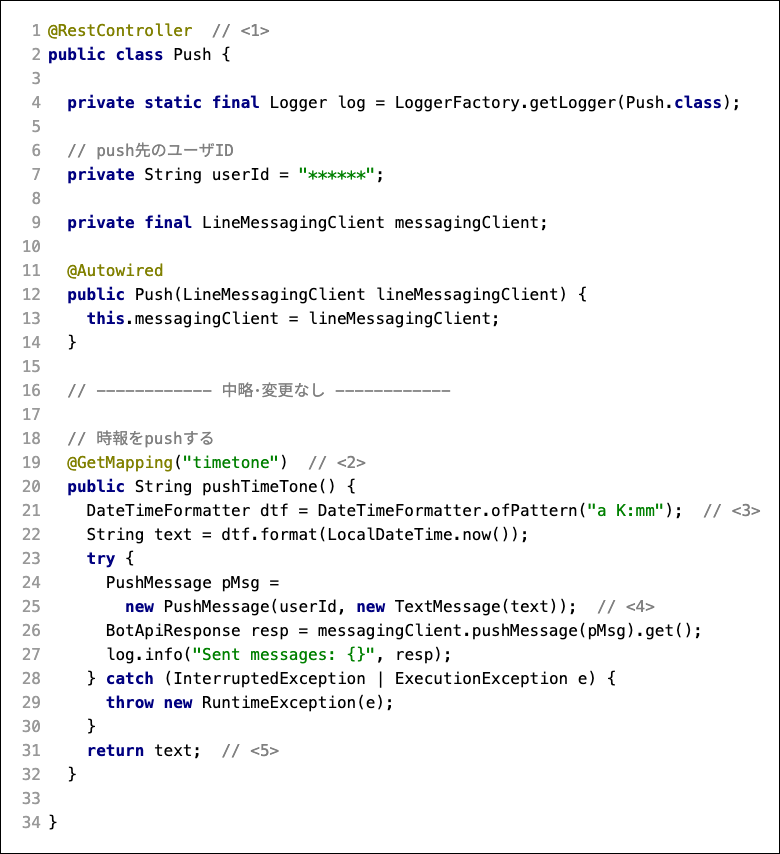
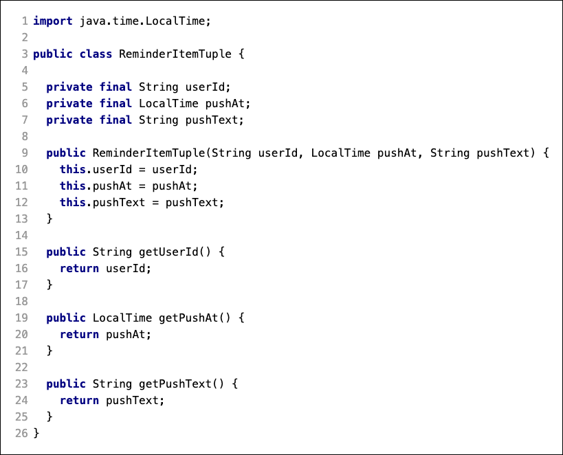

= LINEBOTがPush通知をできるようにする
:encoding: utf-8
:backend: html5
:toc: left
:sectlinks!:
:sectnums:
:toclevels: 2
:doctype: book
:lang: ja
:icons: font
:source-highlighter: coderay

toc::[]

== はじめに

これまでのLINEBotの作り方では、必ずユーザーからメッセージにLINEBotが返答する仕組みであった。

リマインダーのような機能では、事前に登録した内容に基づいて、LINEBotが自動的に通知をしてくれるような方法の方が、ユーザーにとって利便性が高いサービスになるであろう。

この課題では、フレームワークの機能を用いて、上記の様なPush通知を実現する。

特に、*モジュール化を意識し、どのクラスがどの様な責務を果たしているかを考えながら* 作成すること。

ハンズオンはDeveloper Trialプランを前提としているので、Push通知をするBotを作ってみる。

<<<

== メッセージ以外のきっかけでLINEBotが通知を行えるようにする

通常、LINEBotは、ユーザーからのメッセージに対して返答を行う。 +
これは、 *ユーザーのメッセージを受け取る部分（Controller）をきっかけに、対応するプログラム（Model）を実行し、LINEの画面に表示される結果（View）を作っている* と言い換えることができる。

つまり、 *「メッセージ以外の何か」をきっかけとできるControllerがあれば、LINEBotが返答する* ことができる。

まずはメッセージ以外のきっかけで、LINEBotが通知を行う仕組みを試す。

=== ブラウザからのアクセスをきっかけとするController部を作る

動作がわかりやすいように、ブラウザからアクセスすると、LINEBotが動き出す仕組みを作る。

==== Pushクラスを変更

最初にテスト用に作っていたPushクラスを変更して、通知用のクラスにする。

Pushクラスのimportを追加する。

[source, java]
-----
import com.linecorp.bot.client.LineMessagingClient;
import com.linecorp.bot.model.PushMessage;
import com.linecorp.bot.model.message.TextMessage;

import org.slf4j.Logger;
import org.slf4j.LoggerFactory;
import org.springframework.beans.factory.annotation.Autowired;

import java.time.LocalDateTime;
import java.time.format.DateTimeFormatter;
import java.util.concurrent.ExecutionException;
-----

pushTimeTone メソッドを作成する。

[TIPS]
===============================
`userId = "\\******"`  の部分は、 LINE Developers Console の Message API の画面から Your user ID をコピーして、書き換える。
===============================

////
[[app-listing]]
[source,java]
.Push.java
-----
@RestController       // <1>
public class Push {

  private static final Logger log = LoggerFactory.getLogger(Push.class);

  // push先のユーザID
  private String userId = "******";

  private final LineMessagingClient messagingClient;

  @Autowired
  public Push(LineMessagingClient lineMessagingClient) {
    this.messagingClient = lineMessagingClient;
  }

  // ------------ 中略・変更なし ------------

  // 時報をpushする
  @GetMapping("timetone")       // <2>
  public String pushTimeTone() {
    DateTimeFormatter dtf = DateTimeFormatter.ofPattern("a K:mm");       // <3>
    String text = dtf.format(LocalDateTime.now());
    try {
      PushMessage pMsg = new PushMessage(userId, new TextMessage(text));        // <4>
      BotApiResponse resp = messagingClient.pushMessage(pMsg).get();
      log.info("Sent messages: {}", resp);
    } catch (InterruptedException | ExecutionException e) {
      throw new RuntimeException(e);
    }
    return text;        // <5>
  }

}
-----
////

<1> `@RESTController` は、このクラスをWebブラウザからのアクセスを引き受けるControllerにするための、Springフレームワークのアノテーション。 +
つまり、Pushクラスは、ブラウザからのアクセスを受け取るという責務をもった、Controller役のモジュールになる。
<2> `@GetMapping("timetone")` は、このメソッドが動き始めるためのURLが指定されている。つまり、 `https://.../timetone` にアクセスがあると、Pushクラスが Controller として責務を果たし、 `timetone` に対応する `pushTimeTone()` メソッドが動き始める。
<3> この部分で、「午前 x:yy」の様な日時のパターンを作成し、 *LocalDateTime.now()* （現在時刻） の文字列を作成する。
<4> こ の部分で、 userId に送信するメッセージ（ `PushMessage` ）を作成し、messagingClient（ `LineMessagingClient` のインスタンス）を使って送信する。 +
messagingClientは、`@Autowired` がついたコンストラクタで、Springが自動的にインスタンス化している。（Autowiredの仕組みは、前回の課題の資料等を確認されたい）
<5> 最後に `return text;` しているが、これはブラウザにも文字列を表示するためである。

==== 動作確認

LINEBotのプログラムを起動し、ngrokでアクセスできるようにした上で、 `https://xxxxxx.jp.ngrok.io/timetone` にアクセスする。（xxxxxxは、各自の環境にあわせる）。

アクセスすると、ブラウザには +
 +
のように表示される。そして同時にLINEBotにも +
 +
のように表示される。

=== Controllerのメソッドを自動的に動作させる

直前の課題で、ブラウザからControllerにアクセスがあれば、時刻をLINEBotが応答するようになった。

ブラウザのアクセスではなく、さらに *Controllerが自動的なきっかけで動作すれば、ユーザーが何もしなくても、LINEBotが自動的に動作する* ように見える。

ここではSpringフレームワークの仕組みを使い、 *「1分経つ」という時間の経過をきっかけとしてControllerを動作* させる。

==== スケジューリング機能で Controller のメソッドを実行する

Springフレームワークでは、時間の経過でプログラムを動作させるスケジューリング機能を利用できる。

===== スケジューリング機能をONにする

LinebotApplicationクラスで、スケジューリング機能をOnにするアノテーションを追加する。

LinebotApplicationクラスのimportを追加する。

[source, java]
-----
import org.springframework.scheduling.annotation.EnableScheduling;
-----

クラスに `@EnableScheduling` アノテーションを追加する。

////
[sourse, java]
-----
@EnableScheduling       // <1>
@SpringBootApplication
public class LinebotApplication {
-----
////

image::fig04.png[]

<1> この部分を追加する

==== pushTimeToneメソッドをスケジューリングで動作させる

PushクラスのpushTimeToneメソッドを、1分ごとに動作させる設定をアノテーションで追加する。

Pushクラスのimportを追加する。

[source, java]
-----
import org.springframework.scheduling.annotation.Scheduled;
-----

pushTimeToneメソッドにアノテーションを追加する。

////
[source, java]
-----
@GetMapping("timetone")
@Scheduled(cron = "0 */1 * * * *", zone = "Asia/Tokyo")   // <1>
public String pushTimeTone() {
-----
////

image::fig05.png[]

<1> この部分を追加する。 `0 */1` は0秒+1分ごとに実行の意味。`0 */5` に変えれば0秒+5分ごとの実行になる。Linux等のcron記法に似ている。

==== 動作確認

LINEBotのプログラムを起動し、ngrokでアクセスできるようにする。

1分ごとに、LINEBotからLINEにメッセージが投稿される。

image::fig06.png[]

[WARNING]
===============================
️開発用のプランでは、Botからのメッセージ配信数/月に制限があるので、送りすぎに注意！ （毎月1000通まで）

> https://www.linebiz.com/jp/service/line-official-account/
===============================

===== ここまで完了した学生は、課題をコミット/pushしてください。

[source, bash]
-----
git commit -m "課題5-2を終了"
git push
-----

<<<

== データベースのデータを通知できるようにする

*データベースに登録されている、リマインダの時刻と内容を使って、LINEBotが通知できる* ようにする。

=== データベースのデータを取り出すModel部（Repositoryと関係クラス）を作る

==== データベースのReminderItemの1件分を表すクラスを作る

`com.example.linebot.value` パッケージに、ReminderItemTupleクラスを作成する。

////
[source, java]
-----
import java.time.LocalTime;

public class ReminderItemTuple {

  private final String userId;
  private final LocalTime pushAt;
  private final String pushText;

  public ReminderItemTuple(String userId, LocalTime pushAt, String pushText) {
    this.userId = userId;
    this.pushAt = pushAt;
    this.pushText = pushText;
  }

  public String getUserId() {
    return userId;
  }

  public LocalTime getPushAt() {
    return pushAt;
  }

  public String getPushText() {
    return pushText;
  }
}
-----
////

==== ReminderRepositoryに、リマインダを検索するメソッドを作成する

ReminderRepository.java に import を追加する。

[source, java]
-----
import com.example.linebot.value.ReminderItemTuple;
import org.springframework.jdbc.core.DataClassRowMapper;
import java.time.LocalTime;
import java.util.List;
-----

ReminderRepository.java に `findPreviousItems` メソッドを追加する。

////
[source, java]
-----
public List<ReminderItemTuple> findPreviousItems() {
  //language=sql
  String sql = "select user_id, push_at, push_text " +
    "from reminder_item " +
    "where push_at <= ? ";   // <1>

  LocalTime now = LocalTime.now();    // <2>
  List<ReminderItemTuple> list =
    jdbc.query(sql, new DataClassRowMapper<>(ReminderItemTuple.class), now);  // <3>
  return list;
}
-----
////

image::fig09.png[]

[TIPS]
===============================
SQLにスペース等のミスがあると困るので、下のをコピペして利用してもよいです。

[source, java]
-----
String sql = "select user_id, push_at, push_text " +
    "from reminder_item " +
    "where push_at <= ? ";
-----
===============================

<1> `?` を時間として、ある時間より前にリマインダを設定されているタプルを取り出すSQL。スペース等のミスがあると困るので、下のをコピペして利用してもよいです。
<2> 現在時刻のインスタンスを作成する。
<3> SQLの `?` に現在時刻をあてはめ、結果を `ReminderItem` インスタンスの `(Array)List` で取得する。

[NOTE]
===============================
このように、SQLの `?` の部分を置き換えて実行する方式を *プレースホルダ* とよぶ。これは悪意のあるユーザーからのSQLインジェクションといった攻撃を防ぐために良い方法となる。興味がある学生は原理や使い方を調べてみると良い。
===============================

=== データベースのデータをメッセージに加工するModel部（Service）を作る

==== ReminderService に、リマインダを検索するメソッドを作成する

ReminderService.java に import を追加する。

[source, java]
-----
import com.linecorp.bot.model.PushMessage;
import java.util.List;
-----

ReminderService に doPushReminderItems メソッド　、 toPushMessage メソッドをを作る

////
[source, java]
-----
public List<PushMessage> doPushReminderItems() {
  List<ReminderItemTuple> previousItems =
    repository.findPreviousItems();  // <1>
  List<PushMessage> pushMessages = new ArrayList<>();
  // 本来であればUserIdごとにPushMessageをまとめるべきだが、
  // 授業レベルなので簡略化している
  for (ReminderItemTuple item : previousItems) {  // <2>
    PushMessage pushMessage = toPushMessage(item);
    pushMessages.add(pushMessage);
  }
  return pushMessages;
}

private PushMessage toPushMessage(ReminderItemTuple item) {  // <3>
  String userId = item.getUserId();
  String pushText = item.getPushText();
  String body = String.format("%s の時間です！", pushText);
  return new PushMessage(userId, new TextMessage(body));
}
-----
////

image::fig10.png[]

<1> ReminderRepository がデータを検索した結果（組）を用いる: Serviceが上位モジュール、Repositoryが下位モジュールとして、ServiceがRepositoryの労力を得る。
<2> 検索結果（検索された組）の分だけ繰り返し、通知用のメッセージデータ（ `PushMessage` ）のリストを作る。
<3> 検索結果から通知用メッセージデータを作り出す。

==== Pushクラス（Controller部）と、ReminderService（Model部）をつなげる

わかりやすいように、Push.java の pushTimeTone メソッドとは別のメソッドを作る。

Push.java の pushTimeToneメソッドの `@Scheduled` アノテーションを外す。

////
[source, java]
-----
@GetMapping("timetone")
// @Scheduled(cron = "0 */1 * * * *", zone = "Asia/Tokyo")   // <1>
public String pushTimeTone() {
-----
////

image::fig11.png[]

<1> ここをコメントアウトする。

Push.java が ReminderService を使えるように、フィールド変数とコンストラクタを設定する。

////
[source, java]
-----
  private final ReminderService reminderService;  // <1>

  @Autowired   // <2>
  public Push(LineMessagingClient lineMessagingClient,
              ReminderService reminderService) {
    this.messagingClient = lineMessagingClient;
    this.reminderService = reminderService;
  }
-----
////

image::fig12.png[]

<1> フィールド変数を追加する。
<2> コンストラクタに引数を追加し、`reminderService` を初期化する

新たに、Push.java に PushReminder メソッドを作成する。

////
[source, java]
-----
@Scheduled(cron = "0 */1 * * * *", zone = "Asia/Tokyo")
public void pushReminder() {
  try {
    List<PushMessage> messages =
      reminderService.doPushReminderItems();	// <1>
    for (PushMessage message : messages) {
      BotApiResponse resp =
        messagingClient.pushMessage(message).get(); // <2>
      log.info("Sent messages: {}", resp);
    }
  } catch (InterruptedException | ExecutionException e) {
    throw new RuntimeException(e);
  }
}
-----
////

image::fig13.png[]

[TIPS]
===============================
スペース等のミスがあると困るので、下のをコピペして利用してもよいです。

[source, java]
-----
@Scheduled(cron = "0 */1 * * * *", zone = "Asia/Tokyo")
-----
===============================

<1> ReminderService が作成したメッセージのリストを用いる: Pushが上位モジュール、Serviceが下位モジュールとして、PushがServiceの労力を得る。(つまり、Push -> Service -> Repository の多重のモジュール構造になっている)
<2> メッセージのリスト（複数）の分だけ繰り返し、通知を行う。

==== 動作確認

データベースに格納されているリマインダのうち、時間（push_at）が現在時刻よりも早く設定されているものが、時間になると自動的に表示される。

2分後のリマインダーなどを登録すると、動作確認をしやすい。

===== ここまで完了した学生は、課題をコミット/pushしてください。

[source, bash]
-----
git commit -m "課題5-3を終了した"
git push
-----

<<<

== 通知したリマインダーを削除する

ここまで作成した方法では、図の様に、同じリマインダーが表示され続けてしまう。

image::fig15.png[]

これは、リマインダーが現在時刻よりも前のものをすべて検索しているからである。

これを防止する方法はいくつかあるが、今回は通知メッセージを作成したあとに、現在時刻よりも前のリマインダーを削除してしまうことで、同じリマインダーが表示されることを防止する。

=== データベースのデータを削除するModel部（Repository）を作る

検索と同様に、まずはデータベースを操作するModel部から作成する。

==== ReminderRepositoryに、リマインダを検索するメソッドを作成する

ReminderRepository.java に deletePreviousItems メソッドを追加する。

////
[source, java]
-----
  public void deletePreviousItems() {
    //language=sql
    String sql = "delete from reminder_item " +
      "where push_at <= ? ";

    LocalTime now = LocalTime.now();
    jdbc.update(sql, now);
  }
-----
////

[TIPS]
===============================
SQLにスペース等のミスがあると困るので、下のをコピペして利用してもよいです。

[source, java]
-----
String sql = "delete from reminder_item " +
  "where push_at <= ? ";
-----

このSQLは、reminder_item テーブルの中で、pish_at が `?` 以下のものを削除する。

プレースホルダで `?` に現在時刻が渡されるので、現在時刻より前に発信されるリマインダーのための情報が全て削除さることになる。
===============================

=== 理解度確認をかねて、この後を実装してみましょう。

ReminderRepository の deletePreviousItems メソッドをどこで実行すれば良いか考え、プログラム上で実装しなさい。

また、その理由を、上位モジュール・下位モジュール という単語を使って、TAに説明しなさい。

例えば、うまくいくと次の様な動作になるはずです。

*リマインダーの発信前*

現在時刻が 13:14 だとすると...

.reminder_item テーブルの状況
[format="csv", options="header"]
|===
user_id, push_at, push_text
ABCDEF.... ,13:15:00,授業開始
ABCDEF.... ,16:30:00,授業終了
ABCDEF.... ,12:15:00,昼食
|===

*リマインダーの発信後*

現在時刻が 13:15 になったとすると...

image::fig17.png[]

.reminder_item テーブルの状況
[format="csv", options="header"]
|===
user_id, push_at, push_text
ABCDEF.... ,16:30:00,授業終了
|===

発信したもの（つまり、現在時刻よりも前のリマインダー）が削除される。

===== ここまで完了した学生は、課題をコミット/pushしてください。

[source, bash]
-----
git commit -m "課題5を完了"
git push
-----

