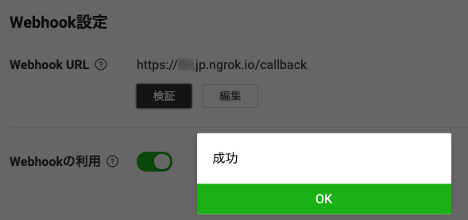
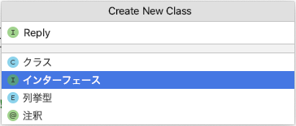
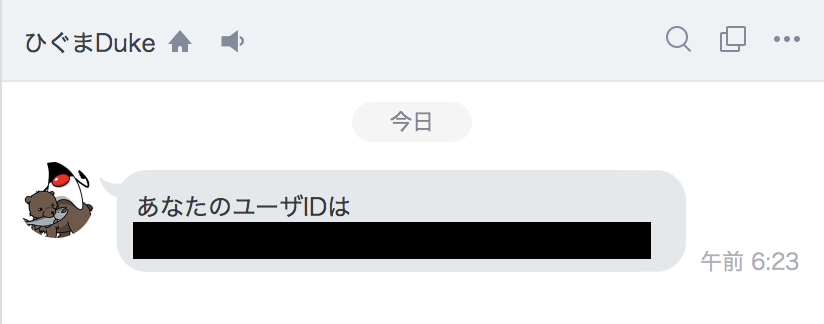

author: @gishi_yama
id: InitProject
categories: java, spring, linebot
status: Draft
environments: Web
feedback link: mailto:cist-softeng-qa@googlegroups.com

# LINEBotの開発環境とプロジェクトを初期設定する

## はじめに

Javaプログラミングの授業の最終課題では、LINEBotを作成した。

ソフトウェア工学概論（山川担当分）では、LINEBotをフロントエンド（ユーザー側のアプリ）と位置付けて、バックエンドやその他システムが連係した情報システム全体の開発体験を行う。

この資料では、LINEBotを改めて準備する。一部はJavaプログラミングの最終課題の繰り返し（続き）復習ととらえ、キーワードやプログラミングの方法など、忘れてしまった部分や不安な部分は [Javaプログラミングの授業資料](https://www.dropbox.com/sh/xlgqb8rx5k3fo82/AABmODCRDpfKK3_EF4HKCWkTa?dl=0) も再度確認しながら取り組むこと。

今回は、LINEBotの開発環境とプロジェクトを初期設定する。**特に、「ngrokの準備と起動」・「`LINE Bot（Message API）の準備」の項目は、各自のPCやアカウント内での現状（Javaプログラミングの最終課題の際の設定状況） ので、を確認し、足りない部分のみ行う** こと。

<!--

## IntelliJ IDEAを更新（ or インストール）する

#### IntelliJ IDEA の更新

は、Javaプログラミングと同じ、IntelliJ IDEAで行う。 IntelliJ IDEAがインストールされている場合は、最新版に更新をすること。最新版のバージョンは `2021.3.3` である。

#### IntelliJ IDEA のインストールが必要な場合

もし、PCを新調したなどの事情でインストールされていない場合は、以下の資料を参考に、JetBrains のサイトから最新版をインストールすること。（学生アカウントの取得は必要な学生のみ）

- [IntelliJ IDEAのダウンロード]()
- [日本語化プラグインのインストール]()

#### IntelliJ IDEAの学生アカウントの期限の確認と更新

学生アカウントは取得後1年間有効だが、もし期限切れの場合は更新をしておくこと。 [JetBrainsのサイト](https://account.jetbrains.com/login) で期限の確認や更新ができる。

## 授業用のプロジェクトのダウンロードと起動

hoghoge

-->

## ngrokの準備と起動

### ngrokをインストールする

[https://ngrok.com/download](https://ngrok.com/download) からダウンロードして、zipを展開する。

### ngrokを起動する

ダウンロードしたディレクトリまで、ターミナル（Windowsの場合はコマンドプロンプト）で移動して、以下を実行する

<aside class="negative">
ターミナルやコマンドプロンプトの使い方はこの授業では解説しないので、各自でWebや書籍等で調べること。<br/>
コロナ下で、大学PCなどを使ったCUI（Character-based User Interface）の使い方に十分に慣れていない学生もいるとおもうが、情報系としては基本技術なので、積極的に利用して慣れた方が良い。
</aside>

Windows の場合

```console
ngrok http --region jp 8080
```

mac の場合

```console
./ngrok http --region jp 8080
```

以下の様に表示されれば成功。`https://xxxxxxxx.jp.ngrok.io` の `xxxxxxxx` の部分は人によってそれぞれ異なる。

```console
ngrok by @inconshreveable                    (Ctrl+C to quit)

Session Status                online        
Session Expires               1 hour, 59 minutes
Version                       2.3.40         
Region                        Japan (jp)     
Web Interface                 http://127.0.0.1:4040
Forwarding                    http://xxxxxxxx.jp.ngrok.io -> http://localhost:8080
Forwarding                    https://xxxxxxxx.jp.ngrok.io -> http://localhost:8080
Connections                   ttl     opn     rt1     rt5     p50     p90
                              0       0       0.00    0.00    0.00    0.00
```

ngrokは起動したままにしておく。特に、

```console
https://xxxxxxxx.jp.ngrok.io
```

のURLは後の手順でもよく使うため、PCのテキストエディタやメモ帳などにコピー＆ペーストしておくとよい。

### 授業用のプロジェクトと組み合わせた動作確認

IntelliJ IDEAを開き、 LinebotApplication を右クリックで起動する。

ブラウザから、ngrokに表示されていた `https://xxxxxxxx.jp.ngrok.io` を使って、 `https://xxx.ngrok.io/test` にもアクセスする（xxxは各自のもの）。以下の様に表示されればOK。

```console
Get from https://xxxxxxxx.jp.ngrok.io/test
```

### ngrokを使うときの注意点

<aside class="negative">
ngrokから発行されるURL（ https://xxxxxxxx.jp.ngrok.io ）はあくまで開発用の一時的なもの。アカウントを登録しないフリープランでは、1回あたり2時間有効になる。

ngrokから発行されるURLは、ngrokを再起動した場合にも再発行される（違うものに変わる）。再発行された場合は、後の手順でこのURLを使っている部分も毎回変更する必要がある。

2時間でURLが変わることが面倒な場合は、ngrokのサイトでユーザー登録をし、Authtokenを設定すれば時間制限はなくなる（詳しくは ngrok のDocumentを参照）
</aside>

### 参考

- [ngrokのDocument](https://ngrok.com/docs)

## LINE Bot（Message API）の準備

### Messaging APIの登録

[LINE Developersコンソールでチャネルを作成する](https://developers.line.me/ja/docs/messaging-api/getting-started/) の、`1. LINE Developersコンソールにログインする` 〜 `5. チャネルを確認する` までの手順を行う。

原則、画像の通りに進めてもらってかまわないが、補足を以下に記載する。

- もし、画面が英語で表示されてしまう場合は、画面右下の言語設定を `English` から `日本語` に切り替える。  
  **⚠️ ブラウザの翻訳は使わないこと**: ブラウザの翻訳機能を使うと、設定に使う文字列など、本来翻訳すべきではない部分も変わってしまう。

- `1. LINE Developersコンソールにログインする` では、それぞれのLINEのアカウントでログインする。
- `2. 開発者として登録する（初回ログイン時のみ）`  では、それぞれのニックネームやメールアドレス（学生の場合は、自身の大学メールアドレス）を入力する。
- `3. 新規プロバイダーを作成する` では、プロパイダー名は任意の（好きな）名前を入力する。
- `4. チャネルを作成する` では...
    - Channel Type（チャンネルの種類）が `Messaging API` になっていることを確認する。
    - `任意` と書かれている項目は空欄でよい。
    - チャンネル名や説明は、個人情報ではない、何か好きなものを入力する。
    - 大業種は `個人` 、小業種は  `個人（IT・コンピュータ）` や `個人（学生）` などを自分の立場にあわせて選ぶ。
    - アイコン画像も自分の好きなものを利用してよいが、[いらすとや](http://www.irasutoya.com/)の素材を使わせてもらうのもよい。

### Messaging APIの設定

[LINE Developersコンソール](https://developers.line.biz/console/) のプロパイダーの欄から、あなたが作成したプロパイダー名 → あなたが作成したチャンネル名 の順に選択する。

チャンネルを開き、`Messaging API設定` のタブを開く。

- **WebHookURL** を、 ngrokで取得した `https://xxxxxxxx.ngrok.io/callback` に変更する（xxxxxxxxは各自のものを使う）
- **Webhookの利用** を、選択状態（緑色）にスイッチする。
- **応答メッセージ** の `編集` を選ぶと、 **応答設定** のウィンドウが開く。
    - `応答メッセージ` を `オフ` にする
    - `あいさつメッセージ` を `オフ` にする
    - `Webhook` は、 **`オン` のまま** にする（間違えないように！）
    - ここまで設定したら、**応答設定** のウィンドウを閉じる。
- **チャネルアクセストークン（長期）** の `発行` ボタンを押す。

に変更する。（各設定項目の **更新ボタン押し忘れ**に注意)

### その他

このMessage APIの設定画面は今後もよく使うので、ブラウザのタブなどで開いたままにしておくと便利。


## LineBotの設定と起動

### propertiesファイルの設定

IntelliJ IDEAに戻って、その他のソース（src/main/resources）の application.properties ファイルを、**前の手順で設定したMessaging APIの設定画面の情報で上書き**する。

**チャンネルシークレットやチャネルアクセストークンの値は個々人によって異なる** 。

- `line.bot.channel-token` には **チャネルアクセストークン（長期）の値** を貼り付ける。  
  **チャネルアクセストークン（長期）の値は、Messaging APIの設定画面の「Messaging API設定」タブ**にある。
- `line.bot.channel-secret` には **チャンネルシークレットの値** を貼り付ける。  
  **チャネルアクセストークン（長期）の値は、Messaging APIの設定画面の「Messaging API設定」タブ**にある。
- どちらも**絶対に改行せずに1行で**貼り付ける。

```properties
line.bot.channel-token=C7gxAFSL8Bs09vz5...
line.bot.channel-secret=i1MZxVT6c...
handler.path=/callback
```

<aside class="negative">
botの調子が悪くなったときに、チャンネルシークレットやチャネルアクセストークンの値を再発行することがある。そのときに、このファイルをよく書き換え忘れることに注意。
</aside>

### 動作確認

ここまで完了すれば、botが動作するようになっている。

**LinebotApplication を再起動** して、**Message API の画面の Webhook設定 の項目で検証ボタン**を押す。



のように表示されればOK。

## LINE Botの中身を作成

### Botをフォローしたときのプログラムを作成する

Botをフォローしたときに、この後の手順で使う`UserId`を返答してくれるようにする。

<aside class="negative">
あくまで体験のための手順なので、**実際の開発時はUserIdを表に出さず、Bot側にデータベースなどを用意して、フォローしたユーザのIDを漏洩しないように記録しておく** ことがよい。
</aside>

#### フォローされた時の返答用クラスの作成

先ほど作ったPushクラスとは別に、ソース・パッケージ（src/main/java）にクラスを作る。

`com.example.linebot.replier` パッケージの中に、`Replire` インターフェースを作る。  
これにより、このインターフェースの実装クラスは、必ず `Message reply() {...};` メソッドを作る、という制限をする

IntelliJ IDEAでは、クラス作成時に インターフェース (interface) を選べば良い。  



```java
package com.example.linebot.replier;

import com.linecorp.bot.model.message.Message;

// 返信用クラスのためのインターフェース
public interface Replier {
 
// 返信用クラスが必ず実装するメソッド
 Message reply();

}
```

`com.example.linebot.replier` パッケージの中に、`Reply` を実装する `Follow` クラスを作る。  
`imprements` キーワードを用いることに注意！

```java
package com.example.linebot.replier;

import com.linecorp.bot.model.event.FollowEvent;
import com.linecorp.bot.model.message.Message;
import com.linecorp.bot.model.message.TextMessage;

// フォローされた時用の返信クラス
public class Follow implements Replier {

  private FollowEvent event;

  public Follow(FollowEvent event) {
    this.event = event;
  }

  @Override
  public Message reply() {
    String userId = this.event.getSource().getUserId();
    String text = String.format("あなたのユーザーID:%s", userId);
    return new TextMessage(text);
  }

}
```

`com.example.linebot` パッケージの中に、`Callback` クラスを新たに作る。

```java
package com.example.linebot;

import com.example.linebot.replier.Follow;
import com.linecorp.bot.model.event.FollowEvent;
import com.linecorp.bot.model.message.Message;
import com.linecorp.bot.spring.boot.annotation.EventMapping;
import com.linecorp.bot.spring.boot.annotation.LineMessageHandler;
import org.slf4j.Logger;
import org.slf4j.LoggerFactory;

@LineMessageHandler
public class Callback {
    
  private static final Logger log = LoggerFactory.getLogger(Callback.class);

  // フォローイベントに対応する
  @EventMapping
  public Message handleFollow(FollowEvent event) {
    // 実際はこのタイミングでフォロワーのユーザIDをデータベースにに格納しておくなど
    Follow follow = new Follow(event);
    return follow.reply();
  }

}
```

`@LineMessageHandler` は、LineBot のコントローラー部として動くクラスであることを設定する。

`@EventMapping` は、メソッドの引数の種類に合わせて、LineBot を通じて送信されてきたメッセージを処理するメソッドであることを設定する。

#### 動作確認

先に **LineBotApplication を停止して、再起動**する。

**Messaging APIの設定画面 に表示されているQRコードを使って、スマートフォンから自分のBotを友達に登録** する。すると、下のようにユーザIdを返答してくれればOK。（このUserIdはフォローした本人のもの）




### 話しかけに応答するプログラムを作成する

こちらから話しかけたことに応答するようにBotを改良する。

#### Parrot クラスを作成

`com.example.linebot.replier` パッケージの中に、`Reply` を実装する `Parrot` クラスを作る。  
`imprements` キーワードを用いることに注意！

```java
package com.example.linebot.replier;

import com.linecorp.bot.model.event.MessageEvent;
import com.linecorp.bot.model.event.message.TextMessageContent;
import com.linecorp.bot.model.message.Message;
import com.linecorp.bot.model.message.TextMessage;

// おうむ返し用の返信クラス
public class Parrot implements Replier {

  private MessageEvent<TextMessageContent> event;

  public Parrot(MessageEvent<TextMessageContent> event) {
    this.event = event;
  }

  @Override
  public Message reply() {
    TextMessageContent tmc = this.event.getMessage();
    String text = tmc.getText();
    return new TextMessage(text);
  }

}
```


#### Callback クラスを変更

追加で以下を import に追加する（同名のクラスが多いので注意）。

```java
import com.linecorp.bot.model.event.message.TextMessageContent;
import com.linecorp.bot.model.event.MessageEvent;
import com.example.linebot.replier.Parrot;
```

```java
@LineMessageHandler
public class Callback {

  // ------------ 中略・変更なし ------------ 

  // 文章で話しかけられたとき（テキストメッセージのイベント）に対応する
  @EventMapping
  public Message handleMessage(MessageEvent<TextMessageContent> event) {
    Parrot parrot = new Parrot(event);
    return parrot.reply();
  }

}
```

`MessageEvent<TextMessageContent>` は、LineBotに送られたテキスト文章を表すクラス。

#### 動作確認

LinebotApplication を一度停止して、再起動する。

LINEでBotに向かって何かメッセージを送ると、Botがそれをオウム返しすることを確認する。


----

### 解説と補足

Javaだけではなく、Webシステムの知識も使った解説です。

この解説を難しく感じる学生も多くいると思います。そういった難しい仕組みを **ライブラリ** として取り組み、public などで公開されたメソッドを使って自らのプログラムに組み込んでいけるところも、Javaプログラムで大切な部分です。

今回であれば、「Line社のサーバーと通信し、特定のBotとメッセージを送受信する部分」を、前のページで導入した「LineBot用の開発ライブラリ」の中のクラスやインスタンスが、みなさんのプログラムと連動して行ってくれています。

#### 以下、ここまで作成した部分の解説。

- `@LineMessageHandler` をつけたclassが、Message APIの設定画面で設定したWebhookURL `https://xxxxxxxx.ngrok.io/callback` の処理用クラスにあたる。このクラスに、Linebotが受診したイベント（メッセージやデータなど）が配送される。

- `@EventMapping`をつけたメソッドが、各イベント（フォロー、話しかけなど）に対応する処理にあたる。どのイベントに対応するかは、引数で与えられたイベントクラスによって変わる（例：フォローイベントは`FollowEvent`クラス）

- イベントの情報は、`event`引数に格納されているので、getメソッドなどで取得できる。どんな情報が入っているかは [公式のドキュメント：Webhookイベントオブジェクト](https://developers.line.biz/ja/reference/messaging-api/#webhook-event-objects) と [これに対応するクラス](https://www.javadoc.io/doc/com.linecorp.bot/line-bot-model/latest/com/linecorp/bot/model/event/package-summary.html) で確認できる。例えばフォローイベントには

  ```json
  {
    "replyToken": "nHuyWiB7yP5Zw52FIkcQobQuGDXCTA",
    "type": "follow",
    "timestamp": 1462629479859,
    "source": {
      "type": "user",
      "userId": "U4af4980629..."
    }
  }
  ```

  といった情報が入っていて、今回の「Botをフォローしたときのプログラムを作成する」では、`event.getSource().getUserId();` で `sourse.userId`の情報を取得している。

- 話しかけてきた相手にテキストメッセージを返すためには、返信メッセージを`Message` のインスタンスを戻り値として返す。今回のプログラム例では `reply` メソッドで返信メッセージを作っている。

- 何も返したくない場合は、戻り値の型を`void`にすればよい。

  ```java
  @EventMapping
  public void handleHoge(HogeEvent event) {
      // BotがHogeEventを受けたときの処理
  }
  ```

- 複数のメッセージを返したい場合は、戻り値の型をListにすればよい。

  ```java
  @EventMapping
  public List<Message> handleHoge(HogeEvent event) {
      // BotがHogeEventを受けたときの処理
      return Arrays.asList(new TextMessage("一行目"), new TextMessage("二行目"));
  }
  ```

- 画像（`ImageMessage）`や位置（`LocationMessage`）等でも返答できる。スタンプ（`StickerMessage`）で返信もできるが、標準スタンプしか返せない…。どんなメッセージが返せるかは[公式のドキュメント：メッセージオブジェクト](https://developers.line.biz/ja/reference/messaging-api/#message-objects) とこれに [対応するクラス](https://www.javadoc.io/static/com.linecorp.bot/line-bot-model/4.8.0/com/linecorp/bot/model/message/package-summary.html) で確認できる。

