author: @gishi_yama
id: DBSettings
categories: java, h2db
status: Published
environments: Web
feedback link: mailto:cist-softeng-qa@googlegroups.com

# H2DBの設定

## はじめに

ここでは、LINEBot用のデータベースとして、H2DBをセットアップする。

通常、データベースは別のサーバー等を用意するが、 **演習用として内臓型のデータベースを準備** する。

### ポイント

1. IntelliJ IDEA で H2DB を利用するための設定を行う（まだ行ってない人向け） 
1. IntelliJ IDEA で H2DB に接続する
1. IntelliJ IDEA で データベースのテーブルを作成する
1. IntelliJ IDEA で テーブルにデータを追加・検索する

## IntelliJ IDEA で H2DB を利用するための設定を行う

画面右側の **データベース（Database）** の帯を押し、データベース ウィンドウを表示する。

Negative
: 画面右側に「データベース」の帯が表示されていない場合は、このページの一番下を先に確認してください。

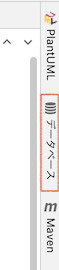

データベース ウィンドウで、 **+ > データソース（Data Sources）> H2** を選ぶ

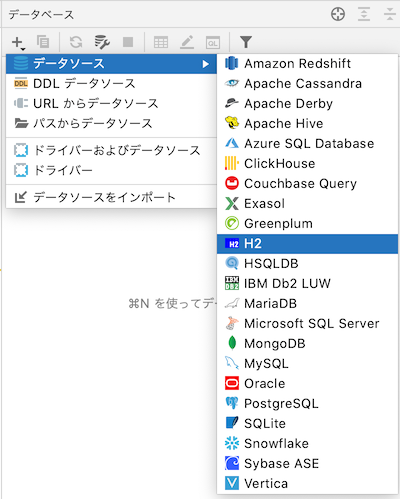

データソースおよびドライバー（Data Sources and Drivers）ウィンドウで、 **ドライバー > H2** を選ぶ。

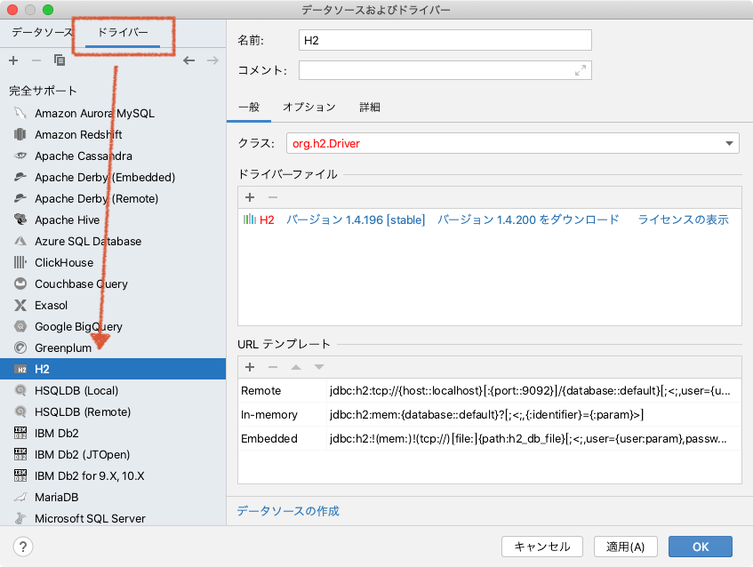

Negative
: 画面の様に、**バージョン 1.4.200 をダウンロード（Download ver. 1.4.200）** と表示されている学生は、 **ダウンロード の文字の部分をクリック** する。  

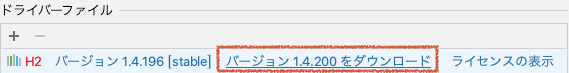

Positive
: バージョン 1.4.200 [stable]（ver. 1.4.200 [stable]）だけが表示されている場合は次の手順へ。

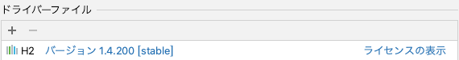

━━━━━━━━━ 当てはまる場合のみ ━━━━━━━━━

### 画面右側に データベース が出てこない場合

次の手順を試してください。

- SHIFTキーを2回押す
- 検索窓に database と入力する
- **プラグイン: Database Tools and SQL** が OFF になっていれば、 **マウスで ON に切り替える**
  
- IntelliJ IDEA を再起動して、もう一度最初の手順からを試す

## IntelliJ IDEA で H2DB に接続する

データソースおよびドライバー（Data Sources and Drivers）ウィンドウで、左側の一覧から、 `default@localhost` を選ぶ。

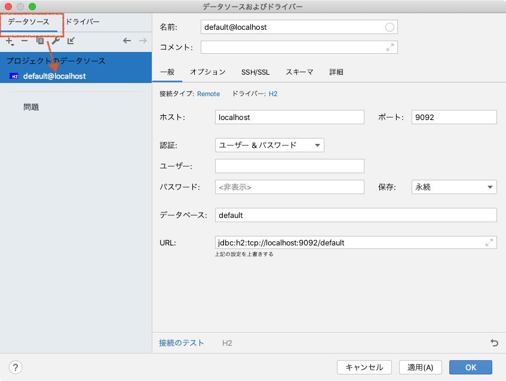

右側の入力欄を次の様に設定する。（指定した部分以外は自動的に設定される）

Negative
: 特に、 **URLの欄はミスをしやすいので、コピー＆ペーストを推奨** する。

- ユーザー: **あなたの学籍番号**
- パスワード: **あなたの学籍番号**
- 保存: **再起動するまで(Until restart)**
- URL: `jdbc:h2:~/h2db/softeng;AUTO_SERVER=TRUE;MODE=PostgreSQL`

全て入力すると、次の様な画面になる。

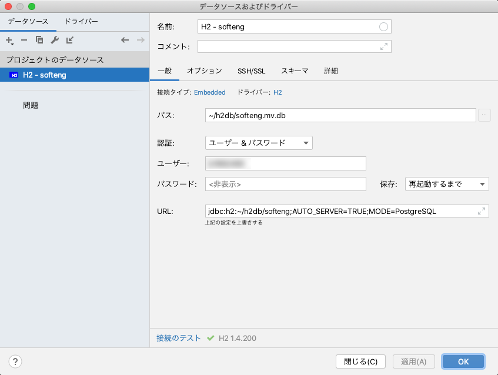

入力を完了したら、 **適用** もしくは **OK** ボタンを押す。

データベースウィンドウに、 **H2 - softeng** が表示されるので、そのすぐ横の **1個中0個を表示** の欄をクリックする（灰色で見づらいので注意！）

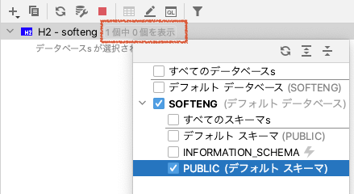

**SOFTENG** の中の **PUBLIC（デフォルト スキーマ）** を選択する。

Positive
: 下の図のような表示になれば、準備完了。    
また、データベースのファイルは、ホームディレクトリ の h2db ディレクトリに `softeng.mv.db` ファイルとして記録されている。

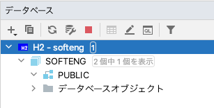

## データベースのテーブルを作成する

### クエリコンソールの起動

データベースウィンドウの **クエリコンソール のアイコンをクリック** し、 **コンソール（デフォルト）** を選ぶ。

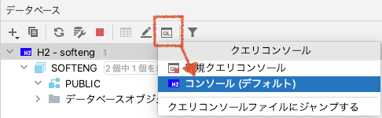

クエリコンソールが表示される。ここにSQLを記載すると、データベースへのクエリとして実行できる。

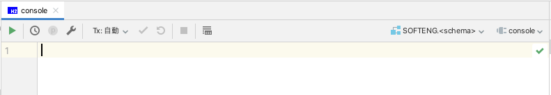

### テーブル作成クエリの実行

テーブル作成クエリとして、 `create table` のSQLを実行する。

クエリコンソールに、以下のようにSQLを入力する。

Negative
:ここもミスがあるとこの先の作業に影響するので、コピー&ペーストを推奨する。

```sql
-- もし、すでにデータベースがあれば削除する（間違った時用）
drop table if exists reminder_item;

-- テーブルを作成する
create table reminder_item (
    user_id varchar(64),
    push_at time,
    push_text varchar(32)
);
```

このSQLは、以下の仕様で `reminder_item` テーブルを作るためのSQLである。

- 文字列型を64文字まで格納する `user_id` 列がある
- time型を格納する`push_at` 列がある
  - `time` 型は時間(例えば **'13:30:00'** のような形式) を格納するための型である
- 文字列型を32文字まで格納する `push_text` 列がある

入力したら、クエリコンソールの再生ボタン ▶︎ をおす。

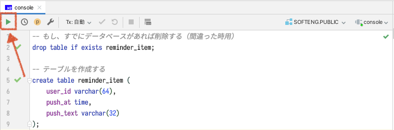

Positive
: データベースウィンドウの テーブルs の中に、以下のようにテーブルと列が作成されていれば成功。

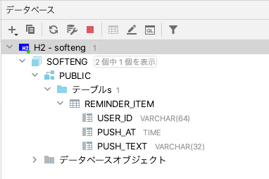

━━━━━━━━━ 当てはまる場合のみ ━━━━━━━━━

Negative
: うまくいかない場合は、必ずエラーログが表示される。 **英語/日本語を問わず、こうしたエラーログを読んで解決できるようになることが上達に非常に重要** である。  
例えば下の図は、SQLにミスがある時のエラーである。

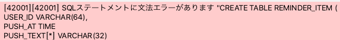

## IntelliJ IDEA で テーブルにデータを追加・検索する

`reminder_item` テーブルに、データを入力する。

### LINE Developers コンソールから、ユーザーIDをコピーする

[LINE Developers コンソール](https://developers.line.biz/console/) で、LINEBotのチャンネルをクリックする。

チャンネル基本設定の下の方に表示されている **あなたのユーザーID** をコピーする。


ここでは、`ABCDEFG...` だと仮定する。

### クエリコンソールから、SQLでデータを追加する

IntelliJ IDEAのクエリコンソールに、以下のようにSQLを入力する。

Negative
: （学生むけ）ここからはSQLに慣れるために、自分で入力してみましょう。

`ABCDEFG...` は、LINE Developers コンソール からコピーした、自分のユーザーIDに変更すること。

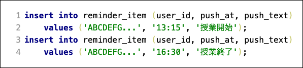

入力したら、クエリコンソールの再生ボタン ▶︎ をおす。

### クエリコンソールから、SQLでデータを検索する

データの追加が成功していれば、以下のような組が reminder_item テーブルに追加されているはずである。

|  user_id | push_At | push_text |
|:----:|:----:|:----:|
|ABCDEFG...|13:15:00|授業開始|
|ABCDEFG...|16:30:00|授業終了|

これを、検索用のSQLを実行して確かめる。

IntelliJ IDEAのクエリコンソールに、以下のようにSQLを入力する。


入力したら、クエリコンソールの再生ボタン ▶︎ をおす。

Positive
: IntelliJ の実行ウィンドウに、以下の様に検索結果が表示されれば成功。

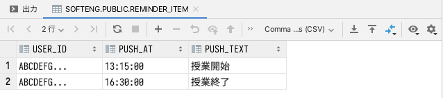