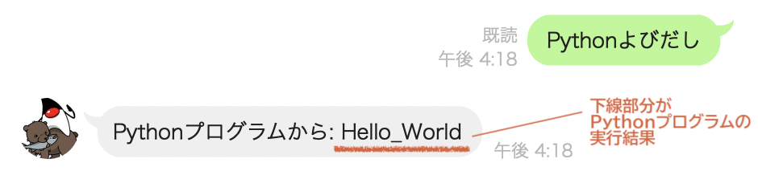
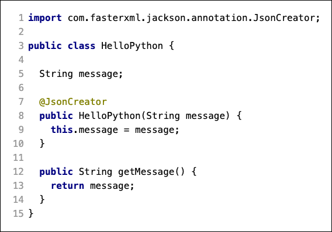
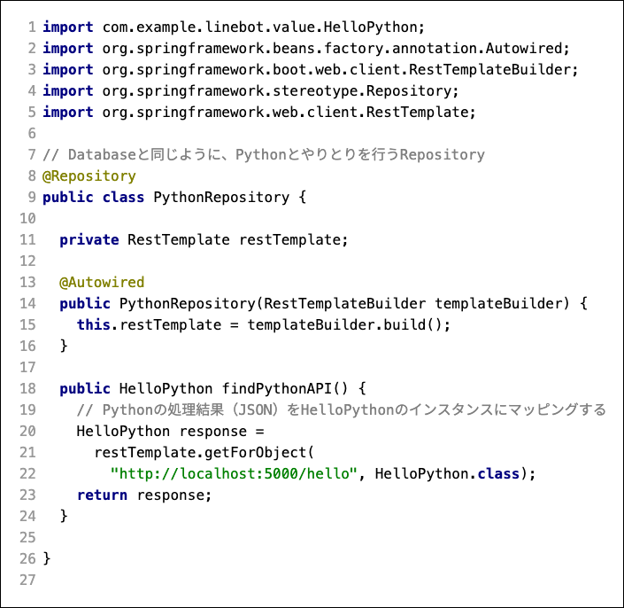
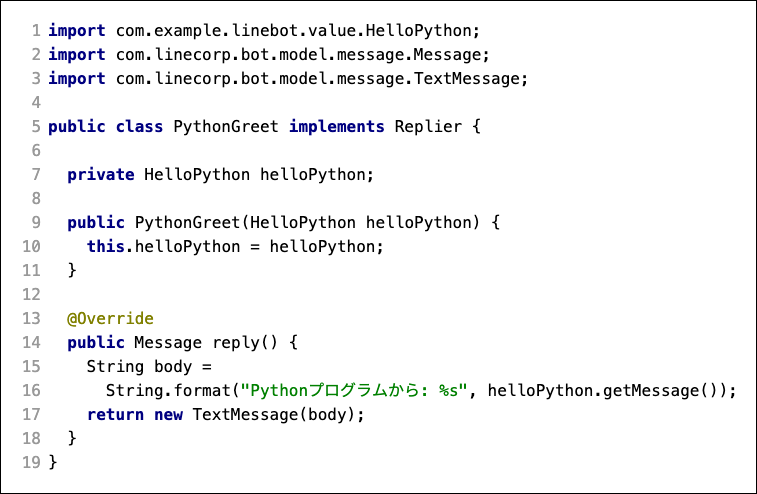
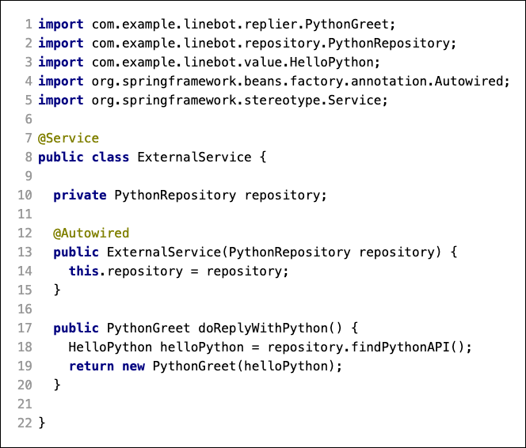
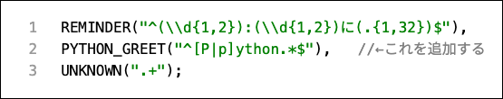
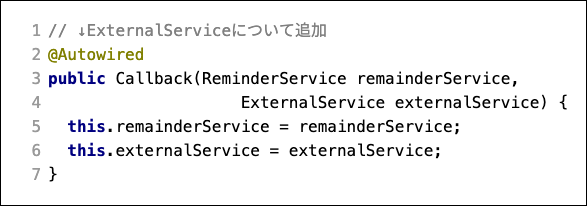
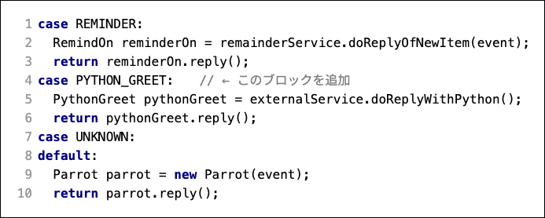

author: @gishi_yama
id: HelloPython
categories: Java
status: Publish
environments: Web
feedback link: mailto:cist-softdsgn-qa@googlegroups.com

# LINEBotと外部のプログラムの連係（情報システム化）

## はじめに

ここでは、LINEBot から、予習で作成した Python プログラムに接続をすることを目的とする。

**PythonプログラムはLINEBotとは別の環境（PyCharm）で動いているプログラム**なので、 **Python側に作られた処理受付窓口** （WEB-API: [http://localhost:5000/hello](http://localhost:5000/hello) ） **を使ってPythonプログラムの実行結果を取得** する。次に、取得した実行結果を使って、 **返答メッセージを作成** する。最後に、 **LINEBotが応答できるインテントを増やし** 、特定のメッセージの時にこの仕組みが動くようにする。

例えば、 **Pythonよびだし** というメッセージが送られてきたら、

- LINEBotが、 **Python〇〇** というパターンのメッセージは、Pythonプログラムを呼び出して返答するインテントだと判断する
- PythonプログラムをWEB-APIを通じて動作させ、実行結果を取得する
- 取得したデータを使って、LINEBotでメッセージ応答する



### ポイント

1. データベースを制御するのと同様に、Springフレームワークの機能を使って、**Pythonプログラムから実行結果を取得するModel部（Repositoryやマッピング用のクラス)を作成** する
1. ↑の上位モジュール役として、 **取得した実行結果をもとに返答用のメッセージ化するModel部（ServiceやReplier）を作成** する。
1.  **新しいインテントを Enum(列挙型) で定義** して、インテントに合わせて、**Controller部（Callback）からModel部が呼び出される** ようにする。

## 基礎知識

### WEB-API

予習で作成したPythonプログラム（ [http://localhost:5000/hello](http://localhost:5000/hello) ）の実行結果は、ブラウザ（ChromeやSafari）でアクセスすると、次のように表示される。

```json
{ "message" : "Hello_World" }
```

このように、特にブラウザ等でも利用できるような **HTTPベースで、要求されたプログラムの処理結果を返す仕組みを WEB-API** と呼ぶ。

専用の通信ではなく、人間がブラウザ等でWebページを閲覧する仕組みの上で、ソフトウェアが違いに処理の要求や処理結果の返答ができるので、**情報システム間の連係を行う上でのデファクトスタンダードな手法** として利用されている。

WEB-APIでは、URLの呼び出し（上記であれば、http://localhost:5000/hello ）をメソッドや関数の呼び出しのように捉え、処理結果（上記であれば `"message" : "Hello_World"`）を他システムで解釈しやすいデータ形式で返答する。特に予習部分では、 **JSON形式** で処理結果を返答している。

Negative
: 特に、**URLの構造や、URLによって行える処理要求が直感的であるように工夫されたWEB-APIのスタイルをREST**と呼び、 **RESTのスタイルに細部まで沿ったWEB-APIをRESTful API** と呼ぶ。この課題では割愛するが、興味がある学生は、スタイルの定義や工夫の仕方を調べてみると、より知識やスキルが深まる。


### JSON形式のデータ

```json
{ "message" : "Hello_World" }
```

JSON形式のデータは、`:` を挟んで左辺の部分（例えば `"message"` )を Key（データ名）、右辺の部分（例えば `"Hello_World"` )を Value（値） として、 **クラスのフィールドのようなデータ構造** を表す。

例えば上のようなJSONデータは、Javaであれば

```java
class 〇〇 {
  String message;
}
```

のようなクラスのインスタンスに `"Hello_World"` の文字が入っていると置き換えて考える（マッピングする）こともできる。

また、JSONは配列構造のようなデータを持つこともできる。

```json
{
  "itemList": [
    {
      "date": "2021-05-21",
      "name_jp": "北海道",
      "npatients": "33318"
    },
    {
      "date": "2021-05-20",
      "name_jp": "北海道",
      "npatients": "32591"
     }
  ]
}
```

例えば上のようなデータは、

```java
class 〇〇 {
  String date;
  String nameJP;
  String npatients;
}

class 〇□ {
  List<〇〇> itemList;  // 配列でもよい
}
```

のような、2つのクラスのインスタンスに置き換えて考える（マッピングする）ことができる。

JSON形式のデータは、いろいろな言語で↑のようなインスタンス（オブジェクト）に復元したり、インスタンス（オブジェクト）からJSON形式のデータを作り出すこともできる。

したがって、**情報システムやソフトウェアの間で、お互いのプログラム言語が違うような場合でも手軽にデータをやりとり** することができるメリットがある。

Positive
: 例えば、 **JSONのデータや、データベースのタプルをJavaのクラス（インスタンス）に置き換えられるようにする** など、ある仕組みのデータ構造を他の仕組みのデータ構造に対応させ当てはめられるようにすることを **マッピング** という。

Positive
: 特に、Javaなどのインスタンスを、マッピング可能なJSONのデータなどに変換することを **シリアライズ** と呼ぶ。逆に、JSONのデータなどを、マッピング可能な Javaなどのインスタンスに変換することを **デシリアライズ** と呼ぶ。（Java/JSON固有の言葉ではなく、例えばメモリ上のデータを外部に書き込み可能にすることを総称して呼ぶ）

## Pythonプログラムから実行結果を取得するModel部

予習段階の Pythonプログラムは WEB-API として処理を受け入れ、処理結果を JSON 形式で返答する。

つまり、LINEBot側から、PythonプログラムのWEB-APIを実行し、受け取った結果をインスタンスにデシリアライズすることができれば、Pythonの処理結果をLINEBotのJavaプログラムでも扱えるようになる。

### JSONの結果をデシリアライズするクラス

`{ "message" : "Hello_World" }` の返答結果をマッピング可能なクラスを作ることで、返答結果をデシリアライズできるようにする。

`com.example.linebot.value` パッケージに、 **HelloPython** クラスを作成する。 



`@JsonCreator` は、Springフレームワークの能力（Jackson）で、JSONデータをデシリアライズする時に使うコンストラクタであることを示す。

コンストラクタ変数 `String message` があることで、JSONの `message` キーとマッピング可能になっている。

また、デシリアライズされた情報は、インスタンスの getMessage メソッドを使えば、他のJavaのプログラムから利用できる。

### WEB-API を呼び出すRepository

Pythonプログラム上の WEB-API を呼び出すクラスを作成する。データベースと同様に、外部のシステムを利用するものなので、Springフレームワークでは Repository の役割を設定する。

`com.example.linebot.repository` パッケージに、 **PythonRepository** クラスを作成する。



Negative
: RestTemplateは、コンストラクタでSpringがインスタンス化(@Autowired)する際の書き方が少しだけこれまでと違うので、注意すること。

ここで、 RestTemplate は、Javaプログラムにとってのブラウザ（ChromeやSafari）と思えば良い。人間がブラウザで http://localhost:5000/hello にアクセスし、その結果 `{ "message" : "Hello_World" }` を目でみるように、Javaプログラムは RestTemplate で http://localhost:5000/hello にアクセスし、その結果 `{ "message" : "Hello_World" }` を HelloPython クラスのインスタンスにマッピングする。 

### Classroom に push

ここまで作成できたら、git（Windowsの方はgit bash, macOSの方はターミナルなど）を使い、Classroom に push する。

Negative
: 自分の Classroom 用のフォルダに移動して実行すること。

```shell
git commit -m "課題6-2まで完了"
git push 
```

## 取得した実行結果をもとに返答用のメッセージ化するModel部

Pythonプログラムの処理結果（JSON）をデシリアライズすることができれば、あとはLINEBotの世界でユーザーにどう返答するかを考えるだけになる。

つまり、この先の課題では、序盤からの課題でも書いているコードと同様になる。ここでは全体の復習と捉えて、 **どのクラスがどのような責務を担当しているか** 、**どのインスタンスがどのインスタンスと連係しているか（モジュール的に）** を意識してプログラミングしてほしい。

### HelloPython を使って返答メッセージを作るクラス

デシリアライズした HelloPython のインスタンスを使って、返答メッセージを作る Replier を作成する。

`com.example.linebot.replier` パッケージに、 `Replier` の実装となる **PythonGreet** クラスを作る。




### HelloPython を取得し、 PythonGreet と組み合わせるService 

Repository から HelloPython インスタンスを取得し、 PythonGreet と組み合わせる Service を作成する。 

`com.example.linebot.service` パッケージに、 **ExternalService** クラスを作る。



### Classroom に push

Negative
: 自分の Classroom 用のフォルダに移動して実行すること。

```shell
git commit -m "課題6-3まで完了"
git push 
```

## 新しいインテントの定義と、Controller部からModel部の呼び出し

LINEBotに話しかけた内容の判断は、インテント（意図）で切り替えていた。

### 新しいインテントの定義

Pythonプログラムへの応答を行うためのインテントを定義する。

`com.example.linebot.replier` パッケージの **Intent** クラスの内容を追加する。

**すでにある `REMINDER` と `UNKNOWN` の定義の間** に、インテントとなる正規表現を一つ挟み込む。



`^[P|p]ython.*$` は、文頭が Python（もしくは python ）ではじまる文章であることを表す。

つまり **Pythonよびだし**　**pythonをよびだす** のような、 **Python◯◯** という文章が送られた時を意図として利用できる。

### Controller部からModel部の呼び出し

追加したインテントで、今回作成した ExternalService （ひいては、Pythonプログラムとの連係）を呼び出すようにする。

Callbackクラスのコンストラクタで、 ExternalService をSpringがインスタンス化できるようにする。



handleMessage メソッドの switch 文を修正する。



### 動作確認

PyCharmで、予習で作成したPythonプログラムを起動する。

次に、IntelliJ IDEA, ngrok でLINEBotを起動する。

起動したLINEBotに画像のようなメッセージを送信し、Pythonプログラムの返答を含んだメッセージが帰ってくることを確認する。

動作をTA/SAにもチェックしてもらい、課題の完了の確認を得ること。


### Classroom に push

Negative
: 自分の Classroom 用のフォルダに移動して実行してください。

```shell
git commit -m "課題6をすべて完了"
git push 
```

## おわりに

今回は、自分が作成したPythonプログラムとLINEBotを連係させた。

つまり、 **Pythonが得意とする機械学習などをPythonプログラム側で実装** し、**データ構造化やフレームワークによるプログラムを行えるJavaプログラム側でLINEBotの挙動やデータベース等を制御** することで、人工知能技術を活用するLINEBotのような、モダンな情報システムを作成することができる。
(ここが、次週以降の内容になる）

また、**連係できるのは自らのプログラムだけではない**。例えば、行政が公開しているコロナウィルスの情報などをWEB-APIを通じて取得できれば、今日のコロナウィルス感染者数を答える機能を追加するなど、オープンデータを活用したシステムにも発展させることができる。(最近話題になった、筑波大学のシラバス閲覧システムの代替版を学生が作った、というニュースもこのパターン)

実際に山川が試しに作ってみたオープンデータの利用コード例を置いておくので、興味がある学生はチャレンジしてみるとよい。（※課題とは別です）
