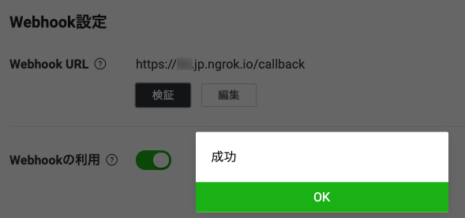
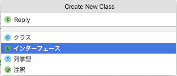

author: @gishi_yama
id: InitProject
categories: Java
status: Publish
environments: Web
feedback link: mailto:cist-softeng-qa@googlegroups.com

# LINE Bot の準備

## はじめに

LINE Bot のバックエンドを作成し、これを通じて、情報システム開発の手順、情報システム内部の構造、情報システム間の通信を体験的に学ぶ。

その中で今回のパートは、各自のPCに必要な環境設定を行い、ベースとなるLINE Botの下準備を行うものである。


### ポイント

1. localtunnelというアプリケーションを用いて（AmazonEC2のように）各自のPCをHTTP(80)でインターネット上からアクセスできるようにする
1. LINE Botの開発用の、LineDevelopers アカウントを取得する。
1. LINE Botの基本的なオウム返しプログラムを作成し、Lineアプリから接続する

（なお、1は都合により昨年度と詳細を変えているが、その他の部分は、2年次のJavaプログラミングの授業で体験済みなので、復習的な内容である）

## localtunnelのインストール

SA/TAが用意してくれた方法を使い、localtunnelを各自のPCにインストールする。

[localtunnelの概要と使用方法](https://hackmd.io/jv4HGYZdSj-TO45H4tG-gA)

Windowsの学生の場合はコマンドプロンプトから、Macの学生の場合はターミナルから、下記のコマンドを実行する。

<aside class="negative">

**注意！**

以下、b22xxxxx は仮のものなので、**それぞれ自分の学籍番号を用いる** こと。 

**学籍番号を間違わないように** すること。他者の学籍番号を使った場合、本来の学籍番号の持ち主側にトラブルが発生し、迷惑になる。

学籍番号間違いはSA/TA側でも対処できないので、しっかり確認すること。

</aside>

```shell
lt --port 8080 --subdomain b22xxxxxx
```

以下のような表記があれば成功である。

```
your url is: https://b22xxxxx.loca.lt
```

**loca.lt の前の部分があなたの学籍番号ではない場合は、設定の失敗や、他の人があなたの学籍番号を間違って使っている場合がある。**

### 解説

ここまでの授業では、Amazon EC2にサーバー用のコンピューターを準備し、これにブラウザからアクセスをしていた。これにより、作成したwww.pyなどのプログラムの実行結果に、誰もがインターネット越しにアクセスできていた。

今回インストールした localtunnel を `lt --port 8080 ...` として起動すると、みなさんのPC（ただし、8080番ポートへのアクセスのみ）を、Amazon EC2のように、インターネット越にアクセスできるようにしている。

これにより、みなさんが自分のPCで、8080番ポートで動くプログラムを作成した場合、以下のURLで、他のPCやアプリケーションからインターネット越しに、そのプログラムへとアクセスができるようになる。


```
https://b22xxxxx.loca.lt
```

`https://b22xxxxx.loca.lt` の80番ポートにhttpでアクセスあった場合、あなたのPCの8080番ポートにアクセスが受け渡される。

このURLは後の手順でもよく使うため、テキストエディタなどにコピー＆ペーストしておくとよい。

<aside>

**おまけコラム：**

今回、本来は外部から接続できない皆さんのPCに対し、 https://b22xxxxx.loca.lt の80番ポートを入り口にする形で、2点間通信をできるようにした。これは、トンネリング通信という技術のひとつである。 （興味がある人はぜひ調べてみてください）

トンネリング通信を簡易に行えるアプリはいくつかあり、2年次のJavaプログラミングでは、ngrokというソフトウェアを使っていた。今回は、皆さんがよりわかりやすいURLなどを発行できる点で、localtunnelを用いている。

ただし、今回のものはあくまで簡易的な（開発中にだけ利用する想定のような）用途のためのトンネリング通信であるため、本来、作ったアプリやシステムを正式な形で外部に提供するときは、サーバーや、EC2などのクラウドそのものにソフトウェアを展開する。 この辺りは、山川パートの発展編で取り上げる予定である。

</aside>

## LINEBotの作成準備

LINE Botを実現するには、当然、Botの中身となるプログラムを準備する必要がある。Botの中身となるプログラムはさまざまな言語で作ることができるが、今回はみなさんがすでに学習済みのJavaを用いる。

JavaでLINE Botを作り始めるために、ベースとなる Spring Framework という仕組みを用いる。

<aside>

**ポイント：**

Framework（フレームワーク）とはそもそも 「どのようなアプリケーションでも概ね同じように作る部分」が、すでに完成されているソフトウェアの半完成品のこと。Spring Frameworkは、たくさんあるフレームワークの中の一つで、JavaでWebアプリ・Webシステムを作る時のデファクトスタンダード的な存在である。

フレームワークをベースにアプリケーションを作成することで、エンジニアは「誰が作っても同じ」部分を省略し、それぞれのアプリケーションの中で「独自に作り込まないといけないこと」に注力できる。

</aside>

### フレームワークが設定された元ファイルをダウンロード

[https://start.spring.io/](https://start.spring.io/) をブラウザ開き、以下の部分を変更する。

- **Project** を `Maven` にする
- **Spring Boot** を `2.7.13` にする
- **Artifact** を `linebot` にする
- **Packaging** を `jar` にする
- **Add Dependencies...** をクリックし、表示されたウィンドウに `Web` と入力し、 `Spring Web` を選ぶ
- **Add Dependencies...** をクリックし、表示されたウィンドウに `Thyme` と入力し、 `Thymeleaf` を選ぶ
- **Add Dependencies...** をクリックし、表示されたウィンドウに `jdbc` と入力し、 `JDBC API` を選ぶ
- **Add Dependencies...** をクリックし、表示されたウィンドウに `h2` と入力し、 `H2 Database` を選ぶ
- 指示された部分以外はそのままでよい。


**Generate** ボタンを押して、zipファイルをダウンロードする。

### IntelliJ IDEAでプロジェクトを読み込む

ダウンロードした linebot.zip ファイルは展開し、フォルダにする。

その上で、以下の手順で、IntelliJ IDEAでプロジェクトを読み込む。

- 開く（Open) で展開したフォルダの中の pom.xml を選択
- プロジェクトとして開く（Open as Project）
- プロジェクトを信頼するか聞かれた場合はプロジェクトを信頼（Trust Project)

必要なファイルが読み込まれるまで、時間がかかる可能性があります。

**画面右下のインジケーターが終了するまで、静かに待ちましょう。**

### Spring Bootの動作確認

ソース・パッケージ（src/main/java）のcom.example.linebotパッケージの中にPushクラスを作る。

```java
package com.example.linebot;

import org.springframework.web.bind.annotation.GetMapping;
import org.springframework.web.bind.annotation.RestController;

import javax.servlet.http.HttpServletRequest;

@RestController
public class Push {

  @GetMapping("test")
  public String hello(HttpServletRequest request) {
    return "Get from " + request.getRequestURL();
  }

}
```

LinebotApplication を右クリックで起動する。

ブラウザから、[http://localhost:8080/test](http://localhost:8080/test) にアクセスする。以下の様に表示されれば成功。

```
Get from http://localhost:8080/test
```

ブラウザから、ngrokに表示されていた `https://b22xxxxx.loca.lt` を使って、 `https://b22xxxxx.loca.lt/test` にもアクセスする（学籍番号は各自のもの）。以下の様に表示されればOK。

```
Get from https://b22xxxxx.loca.lt/test
```

<aside class="negative">

#### localtuunel を使う上での注意

`https://b22xxxxx.loca.lt/test` などにアクセスした時、以下のような画面が表示される場合がある。


これは、悪意のあるユーザーが、フィッシングサイトなどを localtunnel で公開しないようにするための予防措置である。

当然みなさんは学業目的で利用するので、 `If you're the developer...` の項目にしたがって、フィッシングサイトではないことを宣言する。

1. [https://ipv4.icanhazip.com](https://ipv4.icanhazip.com) にアクセスし、自分のローカルネットワークを外側からみた場合のIPアドレスを表示する。（ブラウザ上に xxx.xxx.xxx.xxx のようなIPアドレスで表示される）
2. 表示されたIPアドレスをコピーし、上記の画面に戻り、 `Endpoint IP` 欄に貼り付け、送信する。（フィッシングサイトではないことを宣言する）
3. 宣言は7日間有効なので、7日後にアクセスする場合は、また同様の手段を行う。

なお、上記の操作はブラウザからアクセスする時のみ必要なもので、今後のLINE Botの課題では今後生じないはずであるが、ブラウザで何かを表示させるなどの工夫を行った場合は、上記の操作が改めて必要になることがある。

</aside>

## LINE Bot（Message API）の準備

LINE Botを作るには、LINEの開発者向けサイトで、LINE　Developersアカウントを作成し、LINE Botを作成する必要がある。

Javaプログラミングでも同様のことを一度行っているはずだが、忘れてしまった場合は、再度設定すること。

### LINE Developersアカウントの作成

[LINE Developersコンソールでチャネルを作成する](https://developers.line.me/ja/docs/messaging-api/getting-started/) の、`1. LINE Developersコンソールにログインする` 〜 `5. チャネルを確認する` までの手順を行う。

原則、画像の通りに進めてもらってかまわないが、補足を以下に記載する。

- もし、画面が英語で表示されてしまう場合は、画面右下の言語設定を `English` から `日本語` に切り替える。  
  **⚠️ ブラウザの翻訳は使わないこと**: ブラウザの翻訳機能を使うと、設定に使う文字列など、本来翻訳すべきではない部分も変わってしまう。

- `1. LINE Developersコンソールにログインする` では、それぞれのLINEのアカウントでログインする。
- `2. 開発者として登録する（初回ログイン時のみ）`  では、それぞれのニックネームやメールアドレス（学生の場合は、自身の大学メールアドレス）を入力する。
- `3. 新規プロバイダーを作成する` では、プロパイダー名は任意の（好きな）名前を入力する。
- `4. チャネルを作成する` では...
    - Channel Type（チャンネルの種類）が `Messaging API` になっていることを確認する。
    - `任意` と書かれている項目は空欄でよい。
    - チャンネル名や説明は、個人情報ではない、何か好きなものを入力する。
    - 大業種は `個人` 、小業種は  `個人（IT・コンピュータ）` や `個人（学生）` などを自分の立場にあわせて選ぶ。
    - アイコン画像も自分の好きなものを利用してよいが、[いらすとや](http://www.irasutoya.com/)の素材を使わせてもらうのもよい。

### Messaging APIの設定

[LINE Developersコンソール](https://developers.line.biz/console/) のプロパイダーの欄から、あなたが作成したプロパイダー名 → あなたが作成したチャンネル名 の順に選択する。

チャンネルを開き、`Messaging API設定` のタブを開く。

- **WebHookURL** を、 ngrokで取得した `https://b22xxxxx.loca.lt/callback` に変更する（学籍番号は各自のものう）
- **Webhookの利用** を、選択状態（緑色）にスイッチする。
- **応答メッセージ** の `編集` を選ぶと、 **応答設定** のウィンドウが開く。
    - `応答メッセージ` を `オフ` にする
    - `あいさつメッセージ` を `オフ` にする
    - `Webhook` は、 **`オン` のまま** にする（間違えないように！）
    - ここまで設定したら、**応答設定** のウィンドウを閉じる。
- **チャネルアクセストークン（長期）** の `発行` ボタンを押す。

に変更する。（各設定項目の **更新ボタン押し忘れ**に注意)

### その他

このMessage APIの設定画面は今後もよく使うので、ブラウザのタブなどで開いたままにしておくと便利。

  

## Spring Bootのプロジェクトの編集

### pom.xmlファイルの設定

プロジェクトファイル（ルートフォルダ）のpom.xmlファイルの `<dependencies>〜</dependencies>` の中に、下の内容を追加する。

これにより、プログラムの中にLineBot用の開発ライブラリが導入される。 場所を間違えやすいので注意。

```xml
<dependencies>

    （中略。すでにあるものはそのままにしておく）

    <dependency>
        <groupId>com.linecorp.bot</groupId>
        <artifactId>line-bot-spring-boot</artifactId>
        <version>5.0.3</version>
    </dependency>
</dependencies>
```

変更したら、右クリック > Maven > プロジェクトの再ロード を選択する。これにより、必要なファイル（ライブラリ）が追加でダウンロードされる。（しばらく時間がかかるので、画面右下のインジケーターバーが落ち着くまで待つ）


### propertiesファイルの設定

IDEに戻って、その他のソース（src/main/resources）の application.properties ファイルを、**前の手順で設定したMessaging APIの設定画面の情報で上書き**する。

つまり、 **チャンネルシークレットやチャネルアクセストークンの値は個々人によって異なる** 。

- `line.bot.channel-token` には **チャネルアクセストークン（長期）の値** を貼り付ける。  
  **チャネルアクセストークン（長期）の値は、Messaging APIの設定画面の「Messaging API設定」タブ**にある。
- `line.bot.channel-secret` には **チャンネルシークレットの値** を貼り付ける。  
  **チャネルアクセストークン（長期）の値は、Messaging APIの設定画面の「Messaging API設定」タブ**にある。
- どちらも**絶対に改行せずに1行で**貼り付ける。

```properties
line.bot.channel-token=C7gxAFSL8Bs09vz5...
line.bot.channel-secret=5i1MZxVT6c...
line.bot.handler.path=/callback
```

⚠️ botの調子が悪くなったときに、チャンネルシークレットやチャネルアクセストークンの値を再発行することがある。そのときに、このファイルをよく書き換え忘れることに注意。

### 動作確認

ここまで完了すれば、botが動作するようになっている。

**LinebotApplication を再起動** して、**Message API の画面の Webhook設定 の項目で検証ボタン**を押す。



のように表示されればOK。


## LINE Botの中身を作成

### Botをフォローしたときのプログラムを作成する

Botをフォローしたときに、この後の手順で使う`UserId`を返答してくれるようにする。

⚠️ あくまで体験のための手順なので、**実際の開発時はUserIdを表に出さず、Bot側にデータベースなどを用意して、フォローしたユーザのIDを漏洩しないように記録しておく** ことがよいと思います。

### フォローされた時の返答用クラスの作成

先ほど作ったPushクラスとは別に、ソース・パッケージ（src/main/java）にクラスを作る。

`com.example.linebot.replier` パッケージの中に、`Replire` インターフェースを作る。  
これにより、このインターフェースの実装クラスは、必ず `Message reply() {...};` メソッドを作る、という制限をする

IntelliJ IDEAでは、クラス作成時に インターフェース (interface) を選べば良い。  



```java
package com.example.linebot.replier;

import com.linecorp.bot.model.message.Message;

// 返信用クラスのためのインターフェース
public interface Replier {
 
// 返信用クラスが必ず実装するメソッド
 Message reply();

}
```

`com.example.linebot.replier` パッケージの中に、`Replire` を実装する `Follow` クラスを作る。  
`imprements` キーワードを用いることに注意！

```java
package com.example.linebot.replier;

import com.linecorp.bot.model.event.FollowEvent;
import com.linecorp.bot.model.message.Message;
import com.linecorp.bot.model.message.TextMessage;

// フォローされた時用の返信クラス
public class Follow implements Replier {

  private FollowEvent event;

  public Follow(FollowEvent event) {
    this.event = event;
  }

  @Override
  public Message reply() {
    String userId = this.event.getSource().getUserId();
    String text = String.format("あなたのユーザーID:%s", userId);
    return new TextMessage(text);
  }

}
```

`com.example.linebot` パッケージの中に、`Callback` クラスを新たに作る。

```java
package com.example.linebot;

import com.example.linebot.replier.Follow;
import com.linecorp.bot.model.event.FollowEvent;
import com.linecorp.bot.model.message.Message;
import com.linecorp.bot.spring.boot.annotation.EventMapping;
import com.linecorp.bot.spring.boot.annotation.LineMessageHandler;
import org.slf4j.Logger;
import org.slf4j.LoggerFactory;

@LineMessageHandler
public class Callback {
    
  private static final Logger log = LoggerFactory.getLogger(Callback.class);

  // フォローイベントに対応する
  @EventMapping
  public Message handleFollow(FollowEvent event) {
    // 実際はこのタイミングでフォロワーのユーザIDをデータベースにに格納しておくなど
    Follow follow = new Follow(event);
    return follow.reply();
  }

}
```

`@LineMessageHandler` は、LineBot のコントローラー部として動くクラスであることを設定する。

`@EventMapping` は、メソッドの引数の種類に合わせて、LineBot を通じて送信されてきたメッセージを処理するメソッドであることを設定する。

### 動作確認

先に **LineBotApplication を停止して、再起動**する。

**Messaging APIの設定画面 に表示されているQRコードを使って、スマートフォンから自分のBotを友達に登録** する。すると、下のようにユーザIdを返答してくれればOK。（このUserIdはフォローした本人のもの）


## 話しかけに応答するプログラムを作成する

こちらから話しかけたことに応答するようにBotを改良する。

### Parrot クラスを作成

`com.example.linebot.replier` パッケージの中に、`Replier` を実装する `Parrot` クラスを作る。  
`imprements` キーワードを用いることに注意！

```java
package com.example.linebot.replier;

import com.linecorp.bot.model.event.MessageEvent;
import com.linecorp.bot.model.event.message.TextMessageContent;
import com.linecorp.bot.model.message.Message;
import com.linecorp.bot.model.message.TextMessage;

// おうむ返し用の返信クラス
public class Parrot implements Replier {

  private MessageEvent<TextMessageContent> event;

  public Parrot(MessageEvent<TextMessageContent> event) {
    this.event = event;
  }

  @Override
  public Message reply() {
    TextMessageContent tmc = this.event.getMessage();
    String text = tmc.getText();
    return new TextMessage(text);
  }

}
```


### Callback クラスを変更

追加で以下を import に追加する（同名のクラスが多いので注意）。

```java
import com.linecorp.bot.model.event.message.TextMessageContent;
import com.linecorp.bot.model.event.MessageEvent;
import com.example.linebot.replier.Parrot;
```

```java
@LineMessageHandler
public class Callback {

  // ------------ 中略・変更なし ------------ 

  // 文章で話しかけられたとき（テキストメッセージのイベント）に対応する
  @EventMapping
  public Message handleMessage(MessageEvent<TextMessageContent> event) {
    Parrot parrot = new Parrot(event);
    return parrot.reply();
  }

}
```

`MessageEvent<TextMessageContent>` は、LineBotに送られたテキスト文章を表すクラス。

### 動作確認

LinebotApplication を一度停止して、再起動する。

LINEでBotに向かって何かメッセージを送ると、Botがそれをオウム返しすることを確認する。


## 解説と補足

Javaだけではなく、Webシステムの知識も使った解説です。

この解説を難しく感じる学生も多くいると思います。そういった難しい仕組みを **ライブラリ** として取り組み、public などで公開されたメソッドを使って自らのプログラムに組み込んでいけるところも、Javaプログラムで大切な部分です。

今回であれば、「Line社のサーバーと通信し、特定のBotとメッセージを送受信する部分」を、前のページで導入した「LineBot用の開発ライブラリ」の中のクラスやインスタンスが、みなさんのプログラムと連動して行ってくれています。

### 以下、ここまで作成した部分の解説。

- `@LineMessageHandler` をつけたclassが、Message APIの設定画面で設定したWebhookURL `https://xxxxxxxx.ngrok.io/callback`の処理用クラスにあたる。このクラスに、Linebotが受診したイベント（メッセージやデータなど）が配送される。

- `@EventMapping`をつけたメソッドが、各イベント（フォロー、話しかけなど）に対応する処理にあたる。どのイベントに対応するかは、引数で与えられたイベントクラスによって変わる（例：フォローイベントは`FollowEvent`クラス）

- イベントの情報は、`event`引数に格納されているので、getメソッドなどで取得できる。どんな情報が入っているかは[公式のドキュメント：Webhookイベントオブジェクト](https://developers.line.biz/ja/reference/messaging-api/#webhook-event-objects)と[これに対応するクラス](https://www.javadoc.io/doc/com.linecorp.bot/line-bot-model/latest/com/linecorp/bot/model/event/package-summary.html)で確認できる。例えばフォローイベントには

  ```json
  {
    "replyToken": "nHuyWiB7yP5Zw52FIkcQobQuGDXCTA",
    "type": "follow",
    "timestamp": 1462629479859,
    "source": {
      "type": "user",
      "userId": "U4af4980629..."
    }
  }
  ```

  といった情報が入っていて、今回の「Botをフォローしたときのプログラムを作成する」では、`event.getSource().getUserId();` で `sourse.userId`の情報を取得している。

- 話しかけてきた相手にテキストメッセージを返すためには、返信メッセージを`Message` のインスタンスを戻り値として返す。今回のプログラム例では `reply` メソッドで返信メッセージを作っている。

- 何も返したくない場合は、戻り値の型を`void`にすればよい。

  ```java
  @EventMapping
  public void handleHoge(HogeEvent event) {
      // BotがHogeEventを受けたときの処理
  }
  ```

- 複数のメッセージを返したい場合は、戻り値の型をListにすればよい。

  ```java
  @EventMapping
  public List<Message> handleHoge(HogeEvent event) {
      // BotがHogeEventを受けたときの処理
      return Arrays.asList(new TextMessage("一行目"), new TextMessage("二行目"));
  }
  ```

- 画像（`ImageMessage）`や位置（`LocationMessage`）等でも返答できる。スタンプ（`StickerMessage`）で返信もできるが、標準スタンプしか返せない…。どんなメッセージが返せるかは[公式のドキュメント：メッセージオブジェクト](https://developers.line.biz/ja/reference/messaging-api/#message-objects)とこれに[対応するクラス](https://www.javadoc.io/static/com.linecorp.bot/line-bot-model/4.3.0/com/linecorp/bot/model/message/package-summary.html)で確認できる。


