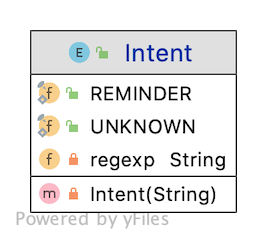
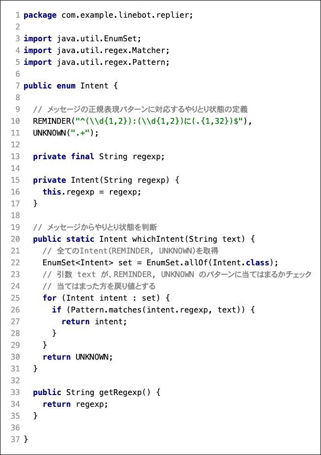

author: @gishi_yama
id: ReminderOn
categories: java
status: Publish
environments: Web
feedback link: mailto:cist-softdsgn-qa@googlegroups.com

# リマインダを登録する

## はじめに

ここでは、 **13:15に授業** などのように時間と用件をLINEBotに話しかけると、それをリマインダの登録要求として識別し、データベースに記録する部分を作成する。

まず、**ユーザのメッセージから、ユーザが何を要求しているのかの意図（インテント）を識別する** 必要がある。インテントを識別したら、メッセージから **要求を実行する条件（スロット）** を分離し、これをもとに **データベースに記録するデータ** を作成する。さらに、 **データベースのテーブルに記録** する。

例えば、 **13:15に授業** というメッセージが送られてきたら、

- **hh:mmに〇〇** というパターンのメッセージは、リマインダ登録のインテントだと判断する
- **時間 hh:mm** と **用件 〇〇** をスロットとし、データベースに記録する


### ポイント

1. **インテントをJavaの Enum(列挙型) で定義** する
1. インテントの識別は、初歩的な方法として **正規表現で識別する仕組み** にする
1. **送信されたメッセージ正規表現パターンを比較し、インテントを識別** する   
1. インテントを識別したメッセージから **スロット（時間と用件）を抽出し、データベースのテーブルに記録するためのデータを作る** （ReminderService）
1. LINEBotの制御にも使っている Spring フレームワークの機能で、**テーブルにデータを記録する** （ReminderRepository）

## インテントを Enum で作成する

このChatBotで識別できるインテントを定義する。

Javaでは、システム内で変わらない定義や定数に `Enum` （列挙型）と呼ばれる特別なクラスを使う。

### Enum を作成する

`com.example.linebot.replier` パッケージの中に、 `Intent` Enum を作る。

IntelliJ IDEA では、クラス作成時に **列挙型（Enum）** を選べば良い。


作成されるIntent Enumは以下のようになる。通常、 `public class XXXX` と書くところが、`public enum XXXX` になっていることに注目。


## 正規表現でインテントを識別する仕組みを作成する

Intent Enum の内容を次のように書き換える。

#### クラス図



#### ソースコード



#### ポイント

```java
"^(\\d{1,2}):(\\d{1,2})に(.{1,32})$"
```

は、**13:15に授業**、 **16:55にバス** などのように、**hh:mmに〇〇** という文字列かどうか識別するための正規表現パターンである。

- hh, mm は最大2文字の数字。〇〇は最大32文字の文字列を想定
- 文字列のパターンに当てはまれば、メッセージが「リマインダを登録したい」インテントだと判断する(`REMINDER`を使う)
- 文字列のパターンに当てはまらない時は、別のインテントだと判断する（`UNKNOWN` を使う）

**whichIntent メソッドは static メソッド** のため、**インスタンス化しなくても呼び出せる** （詳しくは次ページ）。

Negative
: Javaの正規表現をより詳しく勉強したい場合は、[JavaDoc](https://docs.oracle.com/javase/jp/11/docs/api/java.base/java/util/regex/Pattern.html) や [正規表現によるマッチング](https://www.mlab.im.dendai.ac.jp/~yamada/java/regex/) を参考にすると良い  
列挙型をより詳しく勉強したい場合は、[Java列挙型](https://www.ne.jp/asahi/hishidama/home/tech/java/enum.html) や [Typesafe Enum](https://www.javainthebox.net/laboratory/J2SE1.5/LangSpec/TypesafeEnum/TypesafeEnum.html) を参考にすると良い

### Classroom に commit / push

ここまで作成できたら、git（Windowsの方はgit bash, macOSの方はターミナルなど）を使い、Classroom に push しましょう。

Negative
: 自分の Classroom 用のフォルダに移動して実行してください  

```shell
git commit -m "課題4-3まで完了"
git push 
```

## Callback クラスでIntentを判断する

Callbackクラスの handleMessage メソッドで、メッセージとIntentを使った識別を行う。

### Callback クラス に Intent Enum の import に加える


### Callback クラスの handleMessage メソッドの中身を書き換える

Callback クラスの handleMessage メソッドの中身を書き換える。  
これまでの処理はコメントアウトして残しておいても良いし、削除して画像と同じように置き換えても良い。


#### ポイント

- 変更前は、送信された text を使ったswitch文で、返答内容に使うクラスを切り替えていた
- 変更後は、Intentクラスの static メソッドである `Intent.whichIntent(text)` を実行して、textのパターンから Intent (つまり、 `REMINDER` or `UNKNOWN` ) を得る
  - static メソッドは、インスタンス化(new)せずに、クラス名.メソッド名 で利用する。
- さらに、switch 文の引数を `String text` から `Intent intent` に切り替えたことで、 intent = `REMINDER` の時と、 `UNKNOWN` の時で、処理が切り替わるようになった（つまり、**Intentの識別 になった**）


### 動作確認

LINEBot としてプログラムを起動し、 **13:15に授業**　や、 **こんにちは** などを送信してみる。


Positive
: 13:15に授業 を送った時は「リマインダーです」と返信され、それ以外の時にはおうむ返しになれば良い。これにより chatbot が、 **hh:mmに〇〇** というメッセージを、リマインダの登録の意図（インテント）だと判断していることになる。


### Classroom に commit / push

Negative
: 自分の Classroom 用のフォルダに移動して実行してください

```shell
git commit -m "課題4-4まで完了"
git push 
```


## スロット（時間と用件）を抽出する

ここまでの課題で、インテントは識別できるようになったが、そのインテントをどの様な条件（スロット）で実行すれば良いのかはメッセージから抽出できていない。このパートではこの部分を解決する。


### Slotを抽出するクラスを作成する

`com.example.linebot.value` パッケージを作成し、その中に ReminderSlot クラスを作成する。

Positive
: コードが長いので、 InteliJ IDEA の [コード補完機能](https://pleiades.io/help/idea/auto-completing-code.html) を活用して作ると少し楽になります。


#### ReminderSlot のクラス図


#### ReminderSlot のソースコード


#### ポイント

作成した ReminderSlot クラスの中身と見比べてみましょう。

- **13:15に昼食** という文字列を例にすると、時間（13:15）と用件（昼食）をスロットと捉える。
- 時間: `pushAt`, 用件: `puthText` をフィールド変数で管理する
- 引数つきコンストラクタに text で文字列を渡すと、正規表現を使って、以下の部分を文字列から抜き出す
  1. 13 の部分の文字列を抜き出し、整数型の hour とおく
  2. 15 の部分の文字列を抜き出し、整数方の minutes とおく
  3. 13, 15 を使って、時間を表す `LocalTime` 型のインスタンスを作る（ `pushAt` フィールド変数で参照する）  
  4. 昼食 の部分の文字列を抜き出し、`pushText` フィールド変数で参照する
- もし、正規表現にマッチしない（スロットに抽出できない）text が引数に渡された場合は、例外を throw する
- `getPushAt()` , `getPushText()` メソッドで、外部からメソッドの参照を取得できる

Negative
: 正規表現を使って文字列を抜き出す部分は一見難解だが、学んでおくといろいろな処理に応用できて便利。 （例えば、データの加工とか）  
この辺りもわかりやすいスモールケースは [正規表現によるマッチング](https://www.mlab.im.dendai.ac.jp/~yamada/java/regex/) などに掲載されている


### Classroom に commit / push

Negative
: 自分の Classroom 用のフォルダに移動して実行してください

```shell
git commit -m "課題4-5まで完了"
git push 
```

## テーブルに記録するためのデータを作る (1)

抽出したスロットの情報も含めて、データベースのテーブルに記録するデータを作る。

`com.example.linebot.value` パッケージの中に ReminderItem クラスを作成する。

#### ReminderItem のクラス図


#### ReminderItem のソースコード


このクラスは、単なる値の格納用のクラスである。

フィールドに、先ほどを作成した ReminderSlot をコンポジションしていることに注意。

### Classroom に commit / push

Negative
: 自分の Classroom 用のフォルダに移動して実行してください

```shell
git commit -m "課題4-6まで完了"
git push 
```

## テーブルに記録するためのデータを作る (2)

これはリマインダーの主要な処理になるので、Spring フレームワークで `@Service` のクラスを作り、この中でスロットの抽出の処理と、データベース登録用データの作成を実行する。

### 処理結果となる RemindOn クラスを作る

処理結果をLINEBotが返答するための RemindOn クラスを、 Replier インターフェースの実装クラスとして作成する。

#### RemindOn のクラス図


#### RemindOn のソースコード


### 主要な処理を行う ReminderService クラスを作る

`com.example.linebot.service` パッケージを作成し、その中に ReminderService クラスを作成する。

このクラスは、Springが管理する `@Service` クラスに設定する。

#### ReminderService のクラス図


#### ReminderService のソースコード


#### ポイント

- ここまで作成した `ReminderSlot` `ReminderItem` `RemindOn` を全て用いている
- text から `ReminderSlot` を作成する（スロットの抽出）
- `ReminderSlot` と userId から `ReminderItem` を作成する（データベース登録用）
- ただし、まだデータベースに関わる処理はしていないので、登録用のデータを作成するだけである。
- `@Service` アノテーションをつけているので、Springがインスタンス化を管理する

### Classroom に commit / push

Negative
: 自分の Classroom 用のフォルダに移動して実行してください

```shell
git commit -m "課題4-7まで完了"
git push 
```

## ReminderService クラスを Callback クラスから呼び出す

Callbackクラスの handleMessage メソッドで、ReminderService クラスを呼び出す。

ReminderService はSpringがインスタンス化を管理するので、 `@Autowired` でインスタンス化するコンストラクタと、参照先のフィールド変数を用意する。

### Callback クラス に ReminderService クラスの import を加える


###  Callback クラス に、フイールド変数と、引数つきコンストラクタを用意する


### Callback クラス の handleMessage メソッドから、 ReminderService を利用する

破線部分を書き換えている。


### 動作確認

LINEBot としてプログラムを起動し、 **13:15に授業**　や、 **こんにちは** などを送信してみる。


Positive
: 13:15に授業 を送った時は「13:15に授業 を登録しました」と返信され、それ以外の時にはおうむ返しになれば良い。    
もちろん、現時点ではまだデータベースに記録していないので、メッセージ上だけのものである。

### Classroom に commit / push

Negative
: 自分の Classroom 用のフォルダに移動して実行してください

```shell
git commit -m "課題4-8まで完了"
git push 
```


## テーブルにデータを記録する部分の作成(1)

これはデータベースを用いる処理になるので、Spring フレームワークで `@Repository` のクラスを作り、この中でデータベースへの記録を実行する。

### データベースの設定を Spring フレームワークに行う

`src` > `main` > `resources` フォルダにある、 `application.properties` ファイルを開き、次の設定を書き込む。

ミスをすると原因が掴みづらくなるので、コピー&ペーストを推奨する。

Negative
: すでにある `line.bot.channel-token` `line.bot.channel-secret` `handler.path` などは変更せずに、その下に追加設定する。
**b199xxxx の部分は、あなたの学籍番号に書き換える** こと。

```properties
spring.datasource.driver-class-name=org.h2.Driver
spring.datasource.url=jdbc:h2:~/h2db/softeng;AUTO_SERVER=TRUE;MODE=PostgreSQL
spring.datasource.username=b199xxxx
spring.datasource.password=b199xxxx
```

### Classroom に commit / push

Negative
: 自分の Classroom 用のフォルダに移動して実行してください

```shell
git commit -m "課題4-9まで完了"
git push 
```

## テーブルにデータを記録する部分の作成(2)

### データベースの設定が行われた ReminderRepository クラスを作成する

`com.example.linebot.repository` パッケージを作成し、その中に ReminderRepository クラスを作成する。

このクラスは、Springが管理する `@Repository` クラスに設定する。

### ReminderRepository のクラス図


### ReminderRepository のソースコード


`String sql = ...` の部分は途中で + で文字列を結合しているが、**結合の前に必ずスペースを入れておく** 。


#### ポイント

- ここまで作成した `ReminderSlot` `ReminderItem` を用いている
- `sql` が、テーブルにデータを追加するクエリ
- `jdbc.update(...` の部分で、SQLの `?` のところを順番に設定し、SQLを実行している
- `@Repository` アノテーションをつけているので、Springがインスタンス化を管理する
- Springがこのクラスをインスタンス化するときに、`JdbcTemplate` にデータベースの設定を行っている


### Classroom に commit / push

Negative
: 自分の Classroom 用のフォルダに移動して実行してください

```shell
git commit -m "課題4-10まで完了"
git push 
```

## ReminderRepository クラスを ReminderService クラスから呼び出す

データベースを登録できる様にした ReminderRepository クラスを、ReminderService クラスから呼び出して、テーブルに記録するためのデータを実際に記録できる様にする。

### ReminderService クラス に ReminderRepository クラスの import を加える


### ReminderService クラス に、フイールド変数と、引数つきコンストラクタを用意する


### ReminderService クラス の doReplyOfNewItem メソッドから、ReminderRepository を利用する

破線部分を書き換えている。


なお、ここまでの内容が反映された、ReminderService のクラス図は次の様になる。


また、Callback, ReminderService, ReminderRepositoryの呼び出しの関係は、次の様になる。


### 動作確認

LINEBot としてプログラムを起動し、 **12:15に昼食**　や、 **こんにちは** などを送信してみる。


動作は、データベースに接続する前と変わらない。

ただし今回は、データベースのテーブルに組が追加されているはずである。

IntelliJ IDEAのクエリコンソールから、検索クエリを実行し、テーブルの内容を確認する。

```sql
select * from reminder_item;
```


Chatbotに送信した内容が、テーブルの組に追加されている。

Positive
: **時間と用件をいくつか自由に送信し、テーブルに組が追加されていくのを確認しましょう。**

### Classroom に commit / push

Negative
: 自分の Classroom 用のフォルダに移動して実行してください

```shell
git commit -m "課題4をすべて完了"
git push 
```