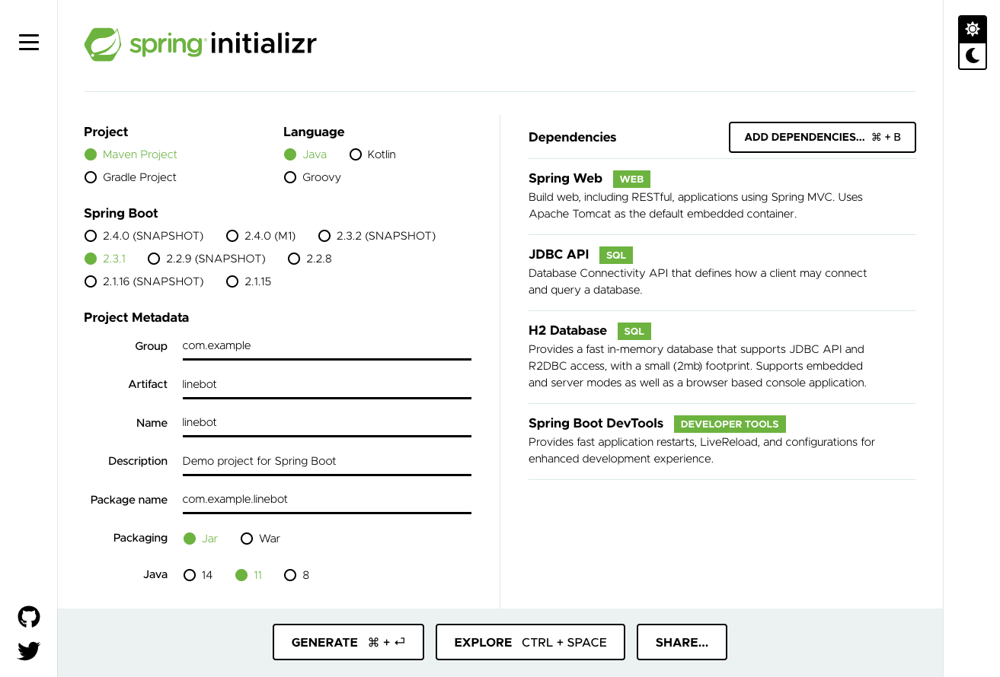

## Spring Bootのプロジェクトの準備

### Srping Boot のプロジェクトを作成する 

https://start.spring.io/ をブラウザ開く。

- **Project** を `Maven Project` にする
- **Language** を `Java` にする
- **Spring Boot** を `2.1.6` にする
- **Artifact** を `linebot` にする
- **Options** を開き、 **Java** を `11` にする
- **Search dependencies to adds** に `Web` を入力し、 `Spring Web Starter` を選ぶ
- **Search dependencies to adds** に `jdbc` を入力し、 `JDBC API` を選ぶ
- **Search dependencies to adds** に `h2` を入力し、 `H2 Database` を選ぶ
- **Search dependencies to add** に `devtools` を入力し、`Spring Boot Devtools` を選ぶ



**Generate the Project** ボタンを押して、zipファイルをダウンロードする。

ダウンロードしたzipファイルは展開しておく。

### IDEでプロジェクトを読み込む

- IntelliJ IDEA
  - import project でフォルダの中の pom.xml を選択
  - `import Maven projects automatically` にチェックして続行
- Eclipse
  - ファイル ＞ インポート ＞ 既存Mavenプロジェクト でフォルダを選択
  - 読み込まれたら、プロジェクトを右クリックして Maven ＞ プロジェクトの更新
- Netbeans
  - ファイル ＞ プロジェクトを開く でフォルダを選択
  - 読み込まれたら、プロジェクトを右クリックして「依存性でビルド」と「消去してビルド」

### Spring Bootの動作確認

ソース・パッケージ（src/main/java）のcom.example.linebotパッケージの中にPushクラスを作る。


```java
package com.example.linebot;

import org.springframework.web.bind.annotation.GetMapping;
import org.springframework.web.bind.annotation.RestController;

import javax.servlet.http.HttpServletRequest;

@RestController
public class Push {

  // テスト
  @GetMapping("test")
  public String hello(HttpServletRequest request) {
    return "Get from " + request.getRequestURL();
  }

}
```

LineBotApplication を右クリックで起動する。

ブラウザから、[http://localhost:8080/test](http://localhost:8080/test) にアクセスする。以下の様に表示されれば成功。

```
Get from http://localhost:8080/test
```

ブラウザから、ngrokに表示されていた `https://xxx.ngrok.io` を使って、 `https://xxx.ngrok.io/test` にもアクセスする（xxxは各自のもの）。以下の様に表示されればOK。 

```
Get from https://xxx.ngrok.io/test
```

-----

[戻る](../README.md)