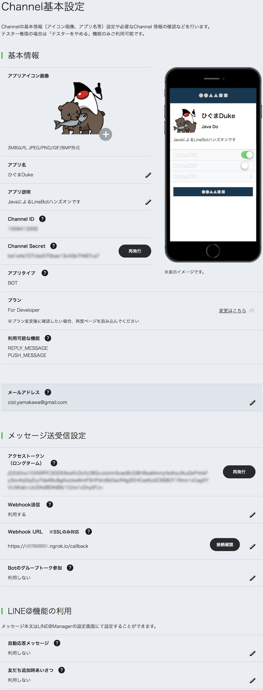

## LINE Bot（Message API）の準備

### Message APIの登録

[LINE developers Message APIを利用するには](https://developers.line.me/ja/docs/messaging-api/getting-started/) の手順で行う。

- 途中、入力する情報（プロパイダー名、アプリ名など）は個人情報でなければ好きに入力して大丈夫。
- プランは `Developer Trial` を選ぶ。
- 大業種は `個人` 、小業種は `個人（学生）` などでよい。
- アイコン画像は、[いらすとや](http://www.irasutoya.com/)の素材を使わせてもらうと早い。
  適当なのがなければ下の画像をどうぞ。
  
  

### Message APIの設定

できあがったMessage APIのチャンネルを開く。

- **アクセストークン（ロングターム）** の `再発行` ボタンを押す。（失効までの時間は0時間でよい）
- **Webhook送信**を `利用する` に変更する
- **WebHookURL**を、 ngrokで取得した`xxx.ngrok.io/callback` に変更する（xxxは各自のもの）
- **自動応答メッセージ**を `利用しない` に変更する
- **友達追加時あいさつ**を `利用しない` に変更する

に変更する。（各設定項目の **更新ボタン押し忘れ**に注意)

#### 登録例

このMessage APIの設定画面は今後もよく使うので、ブラウザのタブなどで開いたままにしておくと便利。

----

[戻る](../README.md)