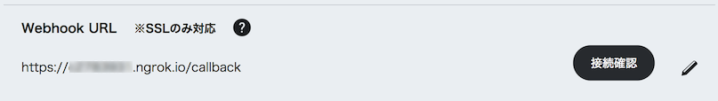

## Spring Bootのプロジェクトの編集

### pom.xmlファイルの設定

プロジェクトファイル（ルートフォルダ）のpom.xmlファイルの `<dependencies>〜</dependencies>` の中に、下の内容を追加する。

```xml
<dependencies>

    （中略。すでにあるものはそのままにしておく）
    
    <dependency>
        <groupId>com.linecorp.bot</groupId>
        <artifactId>line-bot-api-client</artifactId>
        <version>2.6.1</version>
    </dependency>
    
    <dependency>
        <groupId>com.linecorp.bot</groupId>
        <artifactId>line-bot-model</artifactId>
        <version>2.6.1</version>
    </dependency>
    
    <dependency>
        <groupId>com.linecorp.bot</groupId>
        <artifactId>line-bot-servlet</artifactId>
        <version>2.6.1</version>
    </dependency>
    
    <dependency>
        <groupId>com.linecorp.bot</groupId>
        <artifactId>line-bot-spring-boot</artifactId>
        <version>2.6.1</version>
    </dependency>
</dependencies>
```

### propertiesファイルの設定

IDEに戻って、その他のソース（src/main/resources）の application.properties ファイルを、前の手順で設定したMessage APIの設定画面の情報で上書きする。

```properties
line.bot.channel-token=アクセストークン（ロングターム）の値を改行なしで貼り付ける
line.bot.channel-secret=Channel Secretの値を改行なしで貼り付ける
handler.path=/callback
```

⚠️ botの調子が悪くなったときに、アクセストークンやChannel Secretの値を再発行することがある。そのときにこのファイルをよく書き換え忘れることに注意。

###　動作確認

ここまで完了すれば、botが動作するようになっている。

**LineBotApplication を再起動** して、**Message API の画面の Webhook の項目で接続確認ボタン**を押す。



```
✔️ 成功しました。
```

のように表示されればOK。

----

[戻る](../README.md)

