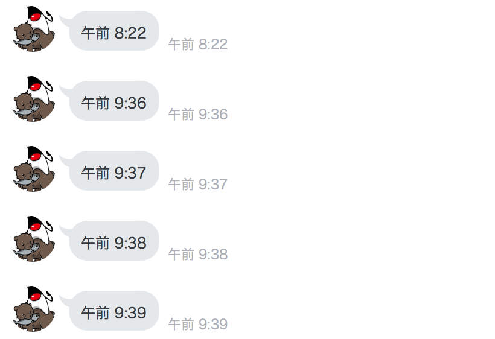

## Botからの話しかけを自動化する

Springのスケジュール機能を使って、定期的にメソッドを実行することで、Botからの話しかけを自動化する。

### LinebotApplicationクラスを変更

最初から作成されていたLinebotApplicationクラスを変更して、Spring bootのスケジュール機能を有効にする。

```java
package com.example.linebot;

import org.springframework.boot.SpringApplication;
import org.springframework.boot.autoconfigure.SpringBootApplication;
import org.springframework.scheduling.annotation.EnableScheduling;

@SpringBootApplication
@EnableScheduling //追加
public class LinebotApplication {

  public static void main(String[] args) {
    SpringApplication.run(LinebotApplication.class, args);
  }

}
```

### Pushクラスを変更

pushクラスに作った`pushTimeTone`メソッドを変更して、定期実行を設定する。

```java
package com.example.linebot;

import com.linecorp.bot.client.LineMessagingClient;
import com.linecorp.bot.model.PushMessage;
import com.linecorp.bot.model.message.TextMessage;
import com.linecorp.bot.model.response.BotApiResponse;
import org.slf4j.Logger;
import org.slf4j.LoggerFactory;
import org.springframework.beans.factory.annotation.Autowired;
import org.springframework.scheduling.annotation.Scheduled;
import org.springframework.web.bind.annotation.GetMapping;
import org.springframework.web.bind.annotation.RestController;

import javax.servlet.http.HttpServletRequest;
import java.time.LocalDateTime;
import java.time.format.DateTimeFormatter;
import java.util.concurrent.ExecutionException;

@RestController
public class Push {

  // ------------ 中略・変更なし ------------ 
    
  // 時報をpush
  @GetMapping("timetone")
  @Scheduled(cron = "0 */1 * * * *", zone = "Asia/Tokyo") 　//追加
  public String pushTimeTone() {
    String text = DateTimeFormatter.ofPattern("a K:mm").format(LocalDateTime.now());
    try {
      PushMessage pMsg
        = new PushMessage(userId, new TextMessage(text));
      BotApiResponse resp = client.pushMessage(pMsg).get();
      log.info("Sent messages: {}", resp);
    } catch (InterruptedException | ExecutionException e) {
      throw new RuntimeException(e);
    }
    return text;
  }

}
```

#### 動作確認

LineBotApplication を一度停止して、再起動する。

1分ごとにBotが現在時刻を送信してくることを確認する。



なお、1分ごとの送信が邪魔であれば、`*/1`の部分を`*/5`にすれば5分おきに、`*/1`の部分を0にすれば毎時0分に設定される。

**⚠️開発用のDeveloper Trialプランでは、Botからのメッセージ配信数/月に制限があるので、送りすぎに注意！[LINE@プラン・料金の「MessagingAPIで利用できる料金プラン」を参考にしてください](https://at.line.me/jp/plan)。**

### 解説と補足

- `@Scheduled(cron = "0 */1 * * * *", ...`は、linuxなどのcron設定の仕組みと似ているが、**秒, 分, 時, 日, 月, 曜日の6桁の設定**であることに注意。
- 送信するメッセージがあるかどうかを定期的に確認するような処理内容に切り替えれば、実際の自動化用途に応用できる。
-  @GetMapping("timetone")は、ブラウザから実行するためのテスト用なので、実際に開発するときには削除してもよい（スケジュール機能で実行する）

-----

[戻る](../README.md)
