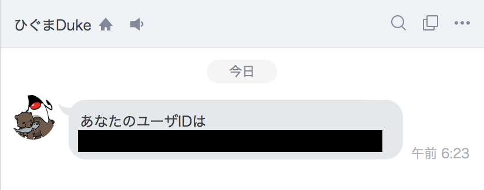
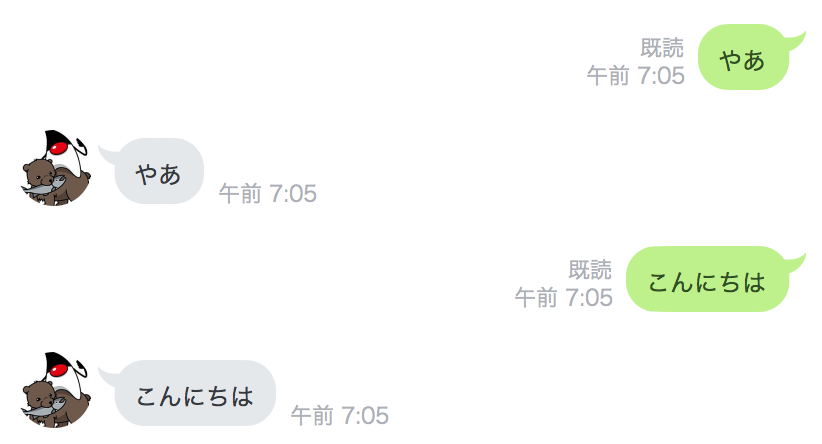

## LINE Botの中身を作成

### Botをフォローしたときのプログラムを作成する

Botをフォローしたときに、この後の手順で使う`UserId`を返答してくれるようにする。

⚠️ あくまで体験のための手順なので、**実際の開発時はUserIdを表に出さず、Bot側にデータベースなどを用意して、フォローしたユーザのIDを記録しておく** ことがよいと思います。

#### フォローされた時の返答用クラスの作成

先ほど作ったPushクラスとは別に、ソース・パッケージ（src/main/java）にクラスを作る。

`com.example.linebot.replier` パッケージの中に、`Reply` インターフェースを作る。  
これにより、このインターフェースの実装クラスは、必ず `Message reply() {...};` メソッドを作る、という制限をする

IntelliJ IDEAでは、クラス作成時に インターフェース (interface) を選べば良い。  



```java
package com.example.linebot.replier;

import com.linecorp.bot.model.message.Message;

// 返信用クラスのためのインターフェース
public interface Replier {
 
// 返信用クラスが必ず実装するメソッド
 Message reply();

}
```

`com.example.linebot.replier` パッケージの中に、`Reply` を実装する `Follow` クラスを作る。  
`imprements` キーワードを用いることに注意！

```java
package com.example.linebot.replier;

import com.linecorp.bot.model.event.FollowEvent;
import com.linecorp.bot.model.message.Message;
import com.linecorp.bot.model.message.TextMessage;

// フォローされた時用の返信クラス
public class Follow implements Replier {

  private FollowEvent event;

  public Follow(FollowEvent event) {
    this.event = event;
  }

  @Override
  public Message reply() {
    String userId = this.event.getSource().getUserId();
    String text = String.format("あなたのユーザーID:%s", userId);
    return new TextMessage(text);
  }

}
```

`com.example.linebot` パッケージの中に、`Callback` クラスを新たに作る。

```java
package com.example.linebot;

import com.example.linebot.replier.Follow;
import com.linecorp.bot.model.event.FollowEvent;
import com.linecorp.bot.model.message.TextMessage;
import com.linecorp.bot.spring.boot.annotation.EventMapping;
import com.linecorp.bot.spring.boot.annotation.LineMessageHandler;
import org.slf4j.Logger;
import org.slf4j.LoggerFactory;


@LineMessageHandler
public class Callback {
    
  private static final Logger log = LoggerFactory.getLogger(Callback.class);

  // フォローイベントに対応する
  @EventMapping
  public Message handleFollow(FollowEvent event) {
    // 実際はこのタイミングでフォロワーのユーザIDをデータベースにに格納しておくなど
    Follow follow = new Follow(event);
    return follow.reply();
  }

}
```

`@LineMessageHandler` は、LineBot のコントローラー部として動くクラスであることを設定する。

`@EventMapping` は、メソッドの引数の種類に合わせて、LineBot を通じて送信されてきたメッセージを処理するメソッドであることを設定する。

#### 動作確認

先に **LineBotApplication を停止して、再起動**する。

Message APIの設定画面に表示されているQRコードを使って、スマートフォンから自分のBotを友達に登録する。下のようにユーザIdを返答してくれればOK。（このUserIdはフォローした本人のもの）




### 話しかけに応答するプログラムを作成する

こちらから話しかけたことに応答するようにBotを改良する。

#### Parrot クラスを作成

`com.example.linebot.replier` パッケージの中に、`Reply` を実装する `Parrot` クラスを作る。  
`imprements` キーワードを用いることに注意！

```java
package com.example.linebot.replier;

import com.example.linebot.replier.Follow;
import com.linecorp.bot.model.event.MessageEvent;
import com.linecorp.bot.model.event.message.TextMessageContent;
import com.linecorp.bot.model.message.Message;
import com.linecorp.bot.model.message.TextMessage;

// おうむ返し用の返信クラス
public class Parrot implements Replier {

  private MessageEvent<TextMessageContent> event;

  public Parrot(MessageEvent<TextMessageContent> event) {
    this.event = event;
  }

  @Override
  public Message reply() {
    TextMessageContent tmc = this.event.getMessage();
    String text = tmc.getText();
    return new TextMessage(text);
  }

}
```


#### Callback クラスを変更

```java
package com.example.linebot;

import com.example.linebot.replier.Follow;
import com.example.linebot.replier.Parrot;
import com.linecorp.bot.model.event.FollowEvent;
import com.linecorp.bot.model.event.MessageEvent;
import com.linecorp.bot.model.event.message.TextMessageContent;
import com.linecorp.bot.model.message.Message;
import com.linecorp.bot.model.message.TextMessage;
import com.linecorp.bot.spring.boot.annotation.EventMapping;
import com.linecorp.bot.spring.boot.annotation.LineMessageHandler;
import org.slf4j.Logger;
import org.slf4j.LoggerFactory;

@LineMessageHandler
public class Callback {

  // ------------ 中略・変更なし ------------ 

  // 文章で話しかけられたとき（テキストメッセージのイベント）に対応する
  @EventMapping
  public Message handleMessage(MessageEvent<TextMessageContent> event) {
    Parrot parrot = new Parrot(event);
    return parrot.reply();
  }

}
```

`MessageEvent<TextMessageContent>` は、LineBotに送られたテキスト文章を表すクラス。

#### 動作確認

LineBotApplication を一度停止して、再起動する。

LINEでBotに向かって何かメッセージを送ると、Botがそれをオウム返しすることを確認する。


----

### 解説と補足

難しいと感じる人は読み飛ばして次の手順に行っても良いです。

- `@LineMessageHandler` をつけたclassが、Message APIの設定画面で設定したWebhookURL `https://xxxxxxxx.ngrok.io/callback`の処理用クラスにあたる

- `@EventMapping`をつけたメソッドが、各イベント（フォロー、話しかけなど）に対応する処理にあたる。どのイベントに対応するかは、引数で与えられたイベントクラスによって変わる（例：フォローイベントは`FollowEvent`クラス）

- イベントの情報は、`event`引数に格納されているので、getメソッドなどで取得できる。どんな情報が入っているかは[公式のドキュメント：Webhookイベントオブジェクト](https://developers.line.me/ja/docs/messaging-api/reference/#anchor-eff5d13cad53e16173242bbc2f157655a9e8dbd8)と[これに対応するクラス](http://static.javadoc.io/com.linecorp.bot/line-bot-model/1.17.0/index.html?com/linecorp/bot/model/event/FollowEvent.html)で確認できる。例えばフォローイベントには

  ```json
  {
    "replyToken": "nHuyWiB7yP5Zw52FIkcQobQuGDXCTA",
    "type": "follow",
    "timestamp": 1462629479859,
    "source": {
      "type": "user",
      "userId": "U4af4980629..."
    }
  }
  ```

  といった情報が入っていて、今回の「Botをフォローしたときのプログラムを作成する」では、`event.getSource().getUserId(;)`で `sourse.userId`の情報を取得している。

- 話しかけてきた相手にテキストメッセージを返すためには、返信メッセージを`Message` のインスタンスを戻り値として返す。今回のプログラム例では `reply` メソッドで返信メッセージを作っている。

- 何も返したくない場合は、戻り値の型を`void`にすればよい。

  ```java
  @EventMapping
  public void handleHoge(HogeEvent event) {
      // BotがHogeEventを受けたときの処理
  }
  ```

- 複数のメッセージを返したい場合は、戻り値の型をListにすればよい。

  ```java
  @EventMapping
  public List<Message> handleHoge(HogeEvent event) {
      // BotがHogeEventを受けたときの処理
      return Arrays.asList(new TextMessage("一行目"), new TextMessage("二行目"));
  }
  ```

- 画像（`ImageMessage）`や位置（`LocationMessage`）等でも返答できる。スタンプ（`StickerMessage`）で返信もできるが、標準スタンプしか返せない…。どんなメッセージが返せるかは[公式のドキュメント：メッセージオブジェクト](https://developers.line.me/ja/docs/messaging-api/reference/#anchor-e65d8a1fb213489f6475b06ad10f66b7b30b0072)とこれに[対応するクラス](http://static.javadoc.io/com.linecorp.bot/line-bot-model/1.17.0/index.html?com/linecorp/bot/model/message/package-tree.html)で確認できる。

----

[戻る](../../README.md)
