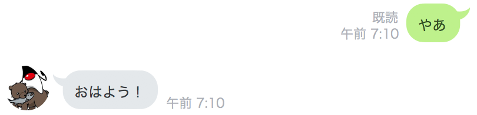

## 時間帯にあわせてあいさつするBot

朝はおはよう、昼はこんにちは、夜はこんばんはと返すようにBotを改良する。

#### Greet クラスを作成

時間帯に合わせて返答を変える処理を行うクラスを作る。

```java
package com.example.linebot.replier;

import com.linecorp.bot.model.message.Message;
import com.linecorp.bot.model.message.TextMessage;

import java.time.LocalTime;

// 挨拶用の返信クラス
public class Greet implements Replier {

  @Override
  public Message reply() {
    LocalTime lt = LocalTime.now();
    int hour = lt.getHour();
    if (hour >= 17) {
      return new TextMessage("こんばんは！");
    }
    if (hour >= 11) {
      return new TextMessage("こんにちは！");
    }
    return new TextMessage("おはよう！");
  }

}
```

#### Callback クラスを変更

追加で以下を import に追加する。

```java
import com.example.linebot.replier.Greet;
```

handleMessage メソッドの中身を修正する。

```java
@LineMessageHandler
public class Callback {

  // ------------ 中略・変更なし ------------ 

  // 文章で話しかけられたとき（テキストメッセージのイベント）に対応する
  @EventMapping
  public Message handleMessage(MessageEvent<TextMessageContent> event) {
    TextMessageContent tmc = event.getMessage();
    String text = tmc.getText();
    switch (text) {
      case "やあ":
        Greet greet = new Greet();
        return greet.reply();
      default:
        Parrot parrot = new Parrot(event);
        return parrot.reply();
    }
  }

}
```

#### 動作確認

LinebotApplication を一度停止して、再起動する。

LINEで、Botに向かって　やあ　と入力して、Botが時間帯にあわせた返答をすることを確認する。(11時以降はこんにちは、17時以降はこんばんは、それ以外はおはようと返します)



-----

[戻る](../../README.md)
