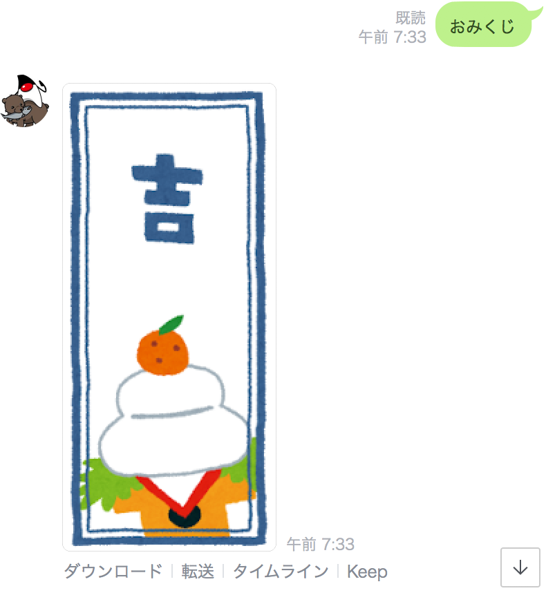

## おみくじBot

おみくじ　と話すと、おみくじ画像を返信してくれるようにBotを改良する。

#### Omikuji クラスを作成

```java
package com.example.linebot.replier;

import com.linecorp.bot.model.message.ImageMessage;
import com.linecorp.bot.model.message.Message;

import java.net.URI;
import java.util.Random;

public class Omikuji implements Replier {
  @Override
  public Message reply() {
    var ranNum = new Random().nextInt(3);
    var uriString = "";
    switch (ranNum) {
      case 2:
        uriString = "https://3.bp.blogspot.com/-vQSPQf-ytsc/T3K7QM3qaQI/AAAAAAAAE-s/6SB2q7ltxwg/s1600/omikuji_daikichi.png";
        break;
      case 1:
        uriString = "https://2.bp.blogspot.com/-27IG0CNV-ZE/VKYfn_1-ycI/AAAAAAAAqXw/fr6Y72lOP9s/s400/omikuji_kichi.png";
        break;
      case 0:
      default:
        uriString = "https://4.bp.blogspot.com/-qCfF4H7YOvE/T3K7R5ZjQVI/AAAAAAAAE-4/Hd1u2tzMG3Q/s1600/omikuji_kyou.png";
    }
    URI uri = URI.create(uriString);
    return new ImageMessage(uri, uri);
  }
}
```

#### Callback クラスを変更

```java
package com.example.linebot;

import com.example.linebot.replier.Follow;
import com.example.linebot.replier.Parrot;
import com.example.linebot.replier.Greet;
import com.example.linebot.replier.Omikuji;
import com.linecorp.bot.model.event.FollowEvent;
import com.linecorp.bot.model.event.MessageEvent;
import com.linecorp.bot.model.event.message.TextMessageContent;
import com.linecorp.bot.model.message.Message;
import com.linecorp.bot.model.message.TextMessage;
import com.linecorp.bot.spring.boot.annotation.EventMapping;
import com.linecorp.bot.spring.boot.annotation.LineMessageHandler;
import org.slf4j.Logger;
import org.slf4j.LoggerFactory;

import java.time.LocalTime;

@LineMessageHandler
public class Callback {

  // ------------ 中略・変更なし ------------ 

  // 文章で話しかけられたとき（テキストメッセージのイベント）に対応する
  @EventMapping
  public Message handleMessage(MessageEvent<TextMessageContent> event) {
    TextMessageContent tmc = event.getMessage();
    String text = tmc.getText();
    switch (text) {
      case "やあ":
        Greet greet = new Greet();
        return greet.reply();
      case "おみくじ":
        Omikuji omikuji = new Omikuji();
        return omikuji.reply();
      default:
        Parrot parrot = new Parrot(event);
        return parrot.reply();
    }
  }

}
```

#### 動作確認

LineBotApplication を一度停止して、再起動する。

LINEで、Botに向かって　おみくじ　と入力して、Botがランダムに画像を返すことを確認する。
（画像は[いらすとや](https://www.irasutoya.com/search?q=%E3%81%8A%E3%81%BF%E3%81%8F%E3%81%98)さんの素材を利用している)



-----

[戻る](../../README.md)
