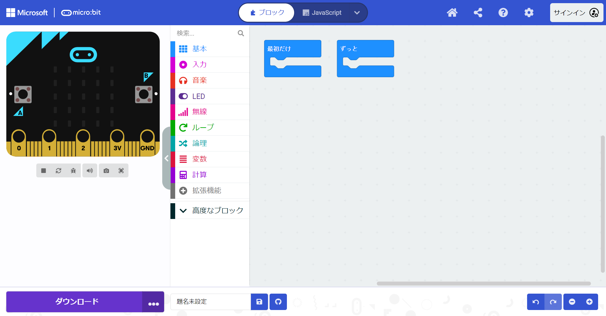
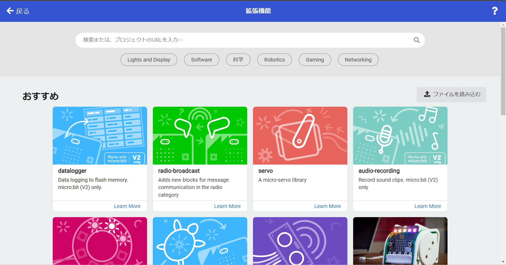
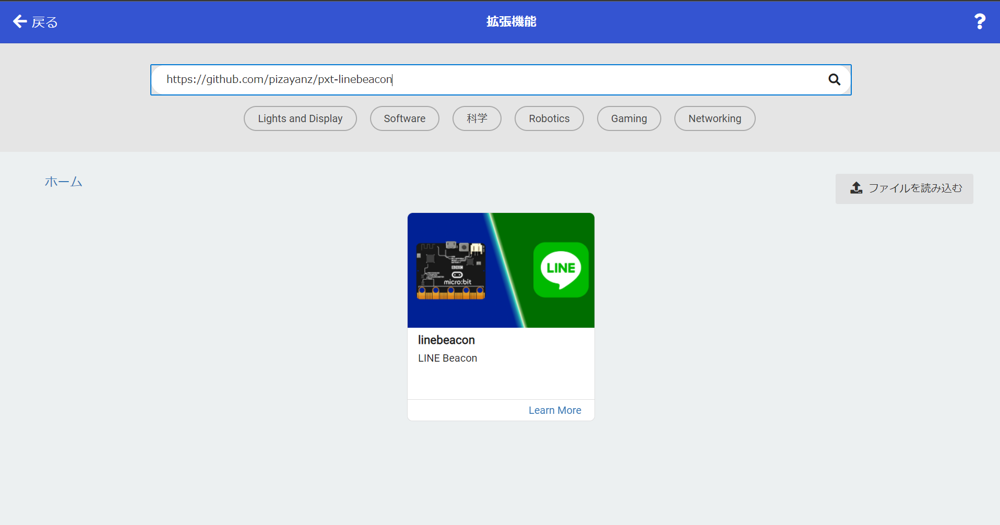
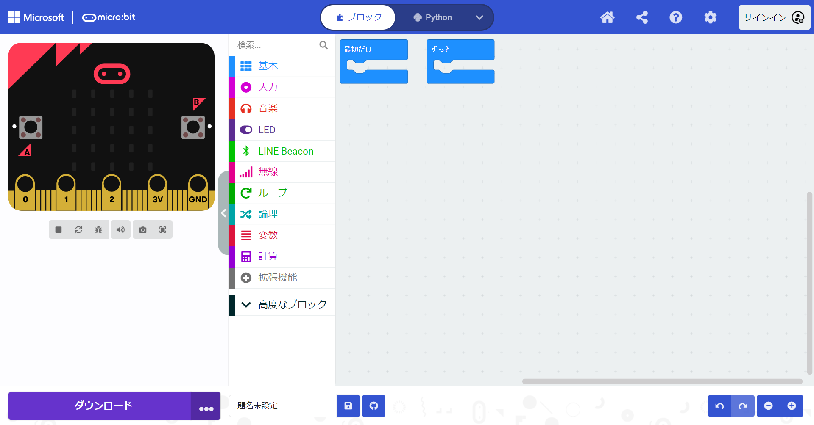
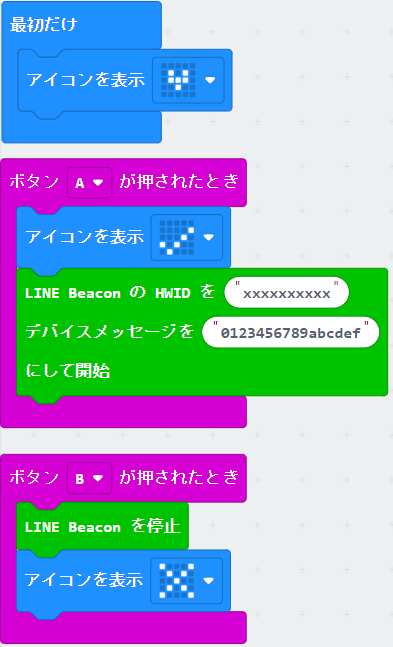

## LINE Beaconを受信する

LINE Beacon と Bot を連携させることで、ビーコンを配置した特定のエリアに近づいた際に特別なメッセージを発話させたり、処理させることができる。

[公式ドキュメント：ビーコンを使う](https://developers.line.me/ja/docs/messaging-api/using-beacons/)

ビーコンは、[Webで購入できる](https://beacon.theshop.jp/items/6617930)。

もしくは、node.jsやBBC micro:bitでビーコンを自作することもできる。

- node.js用　[line/line-simple-beacon](https://github.com/line/line-simple-beacon)
- micro:bit用 [pizayanz/pxt-linebeacon](https://github.com/pizayanz/pxt-linebeacon)
  - (2018年11月現在、旧バージョンのMicrosoft MakeCode for micro:biのみ対応されている)

ここでは、

1. LINE Beacon の ハードウェアID の払い出し
2. micro:bit で LINE Beacon のビーコンを作成する
3. ビーコンのエリアに入った際にBotを反応させる

の手順で進める。

### LINE Beacon の ハードウェアID の払い出し

LINE Beaconを作成するためには ハードウェアID をLINEから払い出してもらう。

1. [LINE@マネージャーのビーコン登録ページ](https://admin-official.line.me/beacon/register) にアクセスする。
2. LINE Developers と同じユーザID・パスワードでログインする。
3. `LINE Simple BeaconのハードウェアID払い出し` ボタンを押す。<br />
4. Beaconを利用するBotの `選択` ボタンを押す。<br />
5. `ハードウェアID発行` ボタンを押す。<br />
6. ハードウェアID（10桁数字）が発行される。メモ帳などにコピーしておく。<br />

### micro:bit で LINE Beacon のビーコンを作成

[BBC micro:bit](https://microbit.org/ja/guide/) は教育用のブロックプログラミング可能な小型マイコンで、[スイッチサイエンス]()や[Amazon JP]()経由で購入できる。

ここでは手元に micro:bit の実機があり、開発しているPCとUSBケーブルで接続されていることを前提に進める。

1. [Microsoft MakeCode for micro:bit](https://makecode.microbit.org/#editor) にアクセスする。<br />
2. `+ 拡張機能` 欄をクリックする。<br /> 
3. `検索またはプロジェクトのURLを入力...` 欄に、[pizayanz/pxt-linebeacon](https://github.com/pizayanz/pxt-linebeacon) のURL `https://github.com/pizayanz/pxt-linebeacon` を入力し、虫眼鏡ボタンを押す。
4. `linebeacon`パッケージが表示されるので、選択する<br />
5.  `LINE Beacon` 欄が表示されていることを確認する。<br />
<br />※なお、元のエディタのメニューに戻したいときは `micro:bit` → `新しいプロジェクト` すれば良い。
6. 以下の図のようにプログラミングする。<br />
    - `アイコンを表示` ブロックは、 `基本` 欄にある。 
    - `LINE Beacon start HWID is...` ブロックは、`LINE Beacon` 欄にある。<br />HWID の `xxxxxxxxxx` は、上の手順で払い出したLINE BeaconのハードウェアIDにする。<br />`with Device Message` は、0〜Fのによる16進数値（最大13バイト:26桁）にする。
    - `LINE Beacon stop` ブロックも、 `LINE Beacon` 欄にある。
7. エディタの `名称未設定` 欄に `linebeacon` と入力し、保存ボタンを押す。
8. ローカルフォルダに、 microbit-linebeacon.hex ファイルが保存されていることを確認する。
9. microbit-linebeacon.hex ファイルをUSBメモリとして認識されている micro:bit にコピーする。
10. micro:bit へのファイル書き込み後、実機のLEDに小さなハートマークが表示される。
    - 実機のAボタンを押すと、チェックマークが表示される。
    - 実機のBボタンを押すと、バツマークが表示される。

### ビーコンのエリアに入った際にBotを反応させる

LINEアプリを起動した端末をLINE Beaconに近づけると、ビーコンイベントがBotに送信される。

Messsage APIでは、このイベントに対するコールバック処理を作成する。

#### Beacon クラスを作成

ビーコンのエリアに入ったときにメッセージを返すクラスを作る。

```java
package com.example.linebeacon.replier;

import com.linecorp.bot.model.event.BeaconEvent;
import com.linecorp.bot.model.message.Message;
import com.linecorp.bot.model.message.TextMessage;

public class Beacon implements Replier{

    private BeaconEvent event;

    public Beacon(BeaconEvent event){
        this.event = event;
    }

    @Override
    public Message reply() {

        //Beaconイベントの内容を文字列に変換する
        String eventStr = this.event.getBeacon().toString();
        //eventStrをBotで返信する
        return new TextMessage(eventStr);
    }
}
```

#### Callbackクラスを変更

ビーコンイベントに対応するメソッドを追加する。<br/>（必要であれば `com.linecorp.bot.model.event.BeaconEvent` を import の行につけくわえる）

```java
  //BeaconEventに対応する
    @EventMapping
    public Message handleBeacon(BeaconEvent event){
        Beacon beacon = new Beacon(event);
        return beacon.reply();
    }
```

### 動作確認

**必ずスマートフォン（タブレット）のLINEアプリで動作確認してください（本稿執筆時点でPC版は対応していない）**

また、動作確認前に、以下のLineアプリの設定を確認してください。

- スマートフォン・タブレット本体の設定で、Lineアプリへの位置情報の提供が「アプリの使用中のみ許可」もしくは「常に許可」になっている
- スマートフォン・タブレット本体の設定で、 Bluetooth の利用がonになっている
- LINEアプリの 設定＞プライバシー管理＞情報の提供 で、 LINE Beacon がONになっている

#### 確認方法 

1. LineBotApplication を一度停止して、再起動する
2. micro:bit を再起動する
3. LINEアプリを開いた状態で、micro:bitに近づける
4. micro:bit のAボタンを押す（ビーコン信号送信開始）
5. Botが、アプリが受信したビーコン信号の内容を投稿する<br />
6. micro:bit のBボタンを押す（ビーコン送信停止）
7. しばらく待つとBotが、アプリが受信したビーコン信号の内容を投稿する<br />

### 解説と補足

LINE BeaconはBluetooth（BLE）の電波で ハードウェアID と deviceMessage を周囲に送る。

この電波をLINEアプリがキャッチすると、 `enter` タイプとして認識されたBeaconイベントを、ハードウェアIDが登録されているBotに通知する。

~~電波がキャッチできなくなって一定時間がたつと、 `leave` タイプとして認識されたBeaconイベントを、ハードウェアIDが登録されているBotに通知する。~~

現在、[`leave`タイプのイベントは廃止](https://developers.line.me/ja/reference/messaging-api/#beacon-event-types)されている。

<br/>

これによって、LINE Beaconに近づいた時（電波が届く範囲に入る： `enter` タイプのイベント）をBotが検知して処理を行うしくみを作れる。例えば「店に入るとBotがクーポンを表示する」といった仕組みに利用されている。


-----

[戻る](../../README.md)
