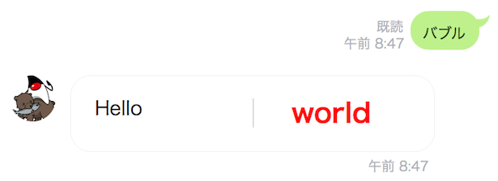

## Flex Message を使う

Flex Message は、コンポーネントベースでBotの吹き出し（「バブル」という）を作成できる。

- [公式ドキュメント：Flex Messageを使う](https://developers.line.me/ja/docs/messaging-api/using-flex-messages/)
- [公式ドキュメント：Flex Messageの要素](https://developers.line.me/ja/docs/messaging-api/flex-message-elements/)

例えば、写真と説明文とボタンを一つのバブルにまとめて表示したり、複数のバブルを横スクロールで表示する（「カルーセル」という）こともできる。

### バブルを表示する

Callbackクラスを変更する。

必要に応じて、以下を import に追加する（同名のクラスが多いので注意）。

- `com.linecorp.bot.model.message.FlexMessage`
- `com.linecorp.bot.model.message.flex.component.*`
- `com.linecorp.bot.model.message.flex.container.Bubble`
- `com.linecorp.bot.model.message.flex.unit.FlexAlign`
- `com.linecorp.bot.model.message.flex.unit.FlexFontSize`
- `com.linecorp.bot.model.message.flex.unit.FlexLayout`
- `java.util.Arrays`

```java  
@LineMessageHandler
public class Callback {

  // ------------ 中略・変更なし ------------
  
  // 文章で話しかけられたとき（テキストメッセージのイベント）に対応する
  @EventMapping
  public Message handleMessage(MessageEvent<TextMessageContent> event) {
    TextMessageContent tmc = event.getMessage();
    String text = tmc.getText();
    switch (text) {
      case "やあ":
        return greet();
      case "おみくじ":
        return replyOmikuji();
      case "部屋":
        return replyRoomInfo();
      case "バブル":
        return replyBubble();
      default:
        return reply(text);
    }
  }

  // ------------ 中略・変更なし ------------ 

  private FlexMessage replyBubble() {
    Text hello = Text.builder()
      .text("Hello")
      .build();

    Text world = Text.builder()
      .text("world")
      .weight(Text.TextWeight.BOLD)
      .size(FlexFontSize.XL)
      .align(FlexAlign.CENTER)
      .color("#FF0000")
      .build();

    Separator separator = Separator.builder().build();

    Box box = Box.builder()
      .layout(FlexLayout.HORIZONTAL)
      .contents(Arrays.asList(hello, separator, world))
      .build();

    Bubble bubble = Bubble.builder()
      .body(box)
      .build();

    return new FlexMessage("BubbleSample", bubble);
  }
  
}
```

### 動作確認

1. LineBotApplication を一度停止して、再起動する
2. LINEアプリで、Botに向かって `バブル` と送信する
3. Botが整形されたFlexメッセージを表示する<br>

### カルーセルを表示する

Callbackクラスを変更する。

必要に応じて、以下を import に追加する（同名のクラスが多いので注意）。

- `com.linecorp.bot.model.action.URIAction`
- `com.linecorp.bot.model.message.flex.container.Carousel`

```java
@LineMessageHandler
public class Callback {

  // ------------ 中略・変更なし ------------
  
  // 文章で話しかけられたとき（テキストメッセージのイベント）に対応する
  @EventMapping
  public Message handleMessage(MessageEvent<TextMessageContent> event) {
    TextMessageContent tmc = event.getMessage();
    String text = tmc.getText();
    switch (text) {
      case "やあ":
        return greet();
      case "おみくじ":
        return replyOmikuji();
      case "部屋":
        return replyRoomInfo();
      case "バブル":
        return replyBubble();
      case "カルーセル":
        return replyCarousel();
      default:
        return reply(text);
    }
  }

  // ------------ 中略・変更なし ------------ 

  private FlexMessage replyCarousel() {
    Text currentTitle = Text.builder()
      .text("今日のイベントはこちら")
      .build();

    Box currentHeader = Box.builder()
      .layout(FlexLayout.VERTICAL)
      .contents(Arrays.asList(currentTitle))
      .build();

    Image currentImage = Image.builder()
      .url("https://connpass-tokyo.s3.amazonaws.com/thumbs/3e/b8/3eb8be3f66515598c47c76bd65e3ebb2.png")
      .size(Image.ImageSize.FULL_WIDTH)
      .aspectMode(Image.ImageAspectMode.Fit)
      .build();

    Text currentText = Text.builder()
      .text("LINE Messaging API for Java でLINE Botを作ってみませんか？\n" +
        "エントリーを考えている方・考えていない方、社会人、学生の皆さん、誰でも大歓迎です！")
      .wrap(true)
      .build();

    Button currentBtn = Button.builder()
      .style(Button.ButtonStyle.SECONDARY)
      .action(new URIAction("表示", "https://javado.connpass.com/event/97107/"))
      .build();

    Box currentBody = Box.builder()
      .layout(FlexLayout.VERTICAL)
      .contents(Arrays.asList(currentText, currentBtn))
      .build();

    Bubble currentBbl = Bubble.builder()
      .header(currentHeader)
      .hero(currentImage)
      .body(currentBody)
      .build();

    Text nextTitle = Text.builder()
      .text("次回のイベントはこちら")
      .build();

    Box nextHeader = Box.builder()
      .layout(FlexLayout.VERTICAL)
      .contents(Arrays.asList(nextTitle))
      .build();

    Image nextImage = Image.builder()
      .url("https://connpass-tokyo.s3.amazonaws.com/thumbs/9a/82/9a82ae80521b1f119cc6ed1e3e5edac0.png")
      .size(Image.ImageSize.FULL_WIDTH)
      .aspectMode(Image.ImageAspectMode.Fit)
      .build();

    Text nextText = Text.builder()
      .text("待ちに待ったスキルの開発環境・CEK(Clova Extension Kit)がお目見えしました!!\n" +
        "Clovaスキルを作ってみたい！Clovaと触れ合いたい！とお考えの皆さんのためにCEKのハンズオンを行います。")
      .wrap(true)
      .build();

    Button nextBtn = Button.builder()
      .style(Button.ButtonStyle.PRIMARY)
      .action(new URIAction("申し込み", "https://linedev.connpass.com/event/96793/"))
      .build();

    Box nextBody = Box.builder()
      .layout(FlexLayout.VERTICAL)
      .contents(Arrays.asList(nextText, nextBtn))
      .build();

    Bubble nextBbl = Bubble.builder()
      .header(nextHeader)
      .hero(nextImage)
      .body(nextBody)
      .build();

    Carousel carousel = Carousel.builder()
      .contents(Arrays.asList(currentBbl, nextBbl))
      .build();

    return new FlexMessage("カルーセル", carousel);
  }
  
}
```

### 動作確認

**必ずスマートフォン（タブレット）のLINEアプリで動作確認してください（PC版でも表示されますが、ボタンが押せないことがあります）**

1. LineBotApplication を一度停止して、再起動する
2. LINEアプリで、Botに向かって `カルーセル` と送信する
3. Botが複数のバブル（カルーセル）を表示する<br>

-----

[戻る](../README.md)
