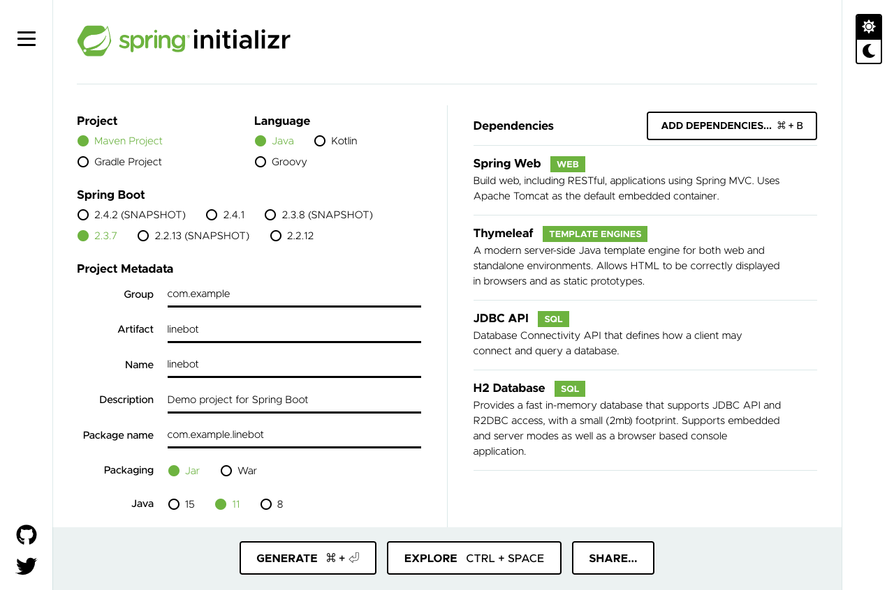

## Spring Bootのプロジェクトの準備

### Srping Boot のプロジェクトを作成する 

https://start.spring.io/ をブラウザ開く。

- **Project** を `Maven Project` にする
- **Language** を `Java` にする
- **Spring Boot** を `2.4.4` にする（実習中に更新された場合は、2.4 の最新版を選ぶ）
- **Artifact** を `linebot` にする
- **Java** を `11` にする
- **Packaging** を `jar` にする
- **Add Dependencies...** をクリックし、表示されたウィンドウに `Web` と入力し、 `Spring Web` を選ぶ
- **Add Dependencies...** をクリックし、表示されたウィンドウに `Thyme` と入力し、 `Thymeleaf` を選ぶ
- **Add Dependencies...** をクリックし、表示されたウィンドウに `jdbc` と入力し、 `JDBC API` を選ぶ
- **Add Dependencies...** をクリックし、表示されたウィンドウに `h2` と入力し、 `H2 Database` を選ぶ



**Generate** ボタンを押して、zipファイルをダウンロードする。

ダウンロードした linebot.zip ファイルは展開しておく。

<div style="page-break-before:always"></div>

### IDEでプロジェクトを読み込む

利用しているIDEにあわせて、それぞれ読み込ませてください。

- IntelliJ IDEAを使っている場合
  - import project でフォルダの中の pom.xml を選択
- Eclipseを使っている場合
  - ファイル ＞ インポート ＞ 既存Mavenプロジェクト でフォルダを選択
  - 読み込まれたら、プロジェクトを右クリックして Maven ＞ プロジェクトの更新
- Netbeansを使っている場合
  - ファイル ＞ プロジェクトを開く でフォルダを選択
  - 読み込まれたら、プロジェクトを右クリックして「依存性でビルド」と「消去してビルド」

必要なファイルが読み込まれるまで、時間がかかる可能性があります。

<div style="page-break-before:always"></div>

### Spring Bootの動作確認

ソース・パッケージ（src/main/java）のcom.example.linebotパッケージの中にPushクラスを作る。

```java
package com.example.linebot;

import org.springframework.web.bind.annotation.GetMapping;
import org.springframework.web.bind.annotation.RestController;

import javax.servlet.http.HttpServletRequest;

@RestController
public class Push {

  // テスト
  @GetMapping("test")
  public String hello(HttpServletRequest request) {
    return "Get from " + request.getRequestURL();
  }

}
```

LinebotApplication を右クリックで起動する。

ブラウザから、[http://localhost:8080/test](http://localhost:8080/test) にアクセスする。以下の様に表示されれば成功。

```
Get from http://localhost:8080/test
```

ブラウザから、ngrokに表示されていた `https://xxxxxxxx.jp.ngrok.io` を使って、 `https://xxx.ngrok.io/test` にもアクセスする（xxxは各自のもの）。以下の様に表示されればOK。 

```
Get from https://xxxxxxxx.jp.ngrok.io/test
```

-----

[戻る](../../README.md)
