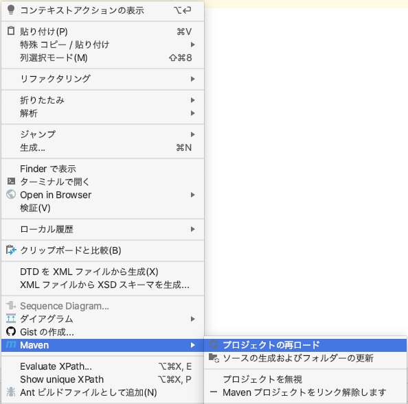

## Spring Bootのプロジェクトの編集

### pom.xmlファイルの設定

プロジェクトファイル（ルートフォルダ）のpom.xmlファイルの `<dependencies>〜</dependencies>` の中に、下の内容を追加する。

```xml
<dependencies>

    （中略。すでにあるものはそのままにしておく）

    <dependency>
        <groupId>com.linecorp.bot</groupId>
        <artifactId>line-bot-spring-boot</artifactId>
        <version>4.3.0</version>
    </dependency>
</dependencies>
```

変更したら、右クリック > Maven > プロジェクトの再ロード を選択する。これにより、必要なファイル（ライブラリ）が追加でダウンロードされる。




### propertiesファイルの設定

IDEに戻って、その他のソース（src/main/resources）の application.properties ファイルを、**前の手順で設定したMessaging APIの設定画面の情報で上書き**する。

つまり、チャンネルシークレットやチャネルアクセストークンの値は個々人によって異なる。

- `line.bot.channel-token` には **チャネルアクセストークン（長期）の値** を貼り付ける。  
**チャネルアクセストークン（長期）の値は、Messaging APIの設定画面の「Messaging API設定」タブ**にある。
- `line.bot.channel-secret` には **チャンネルシークレットの値** を貼り付ける。  
**チャネルアクセストークン（長期）の値は、Messaging APIの設定画面の「Messaging API設定」タブ**にある。
- どちらも**絶対に改行せずに1行で**貼り付ける。

```properties
line.bot.channel-token=C7gxAFSL8Bs09vz5...
line.bot.channel-secret=5i1MZxVT6c...
handler.path=/callback
```

⚠️ botの調子が悪くなったときに、チャンネルシークレットやチャネルアクセストークンの値を再発行することがある。そのときに、このファイルをよく書き換え忘れることに注意。

### 動作確認

ここまで完了すれば、botが動作するようになっている。

**LinebotApplication を再起動** して、**Message API の画面の Webhook設定 の項目で検証ボタン**を押す。


のように表示されればOK。

----

[戻る](../../README.md)

